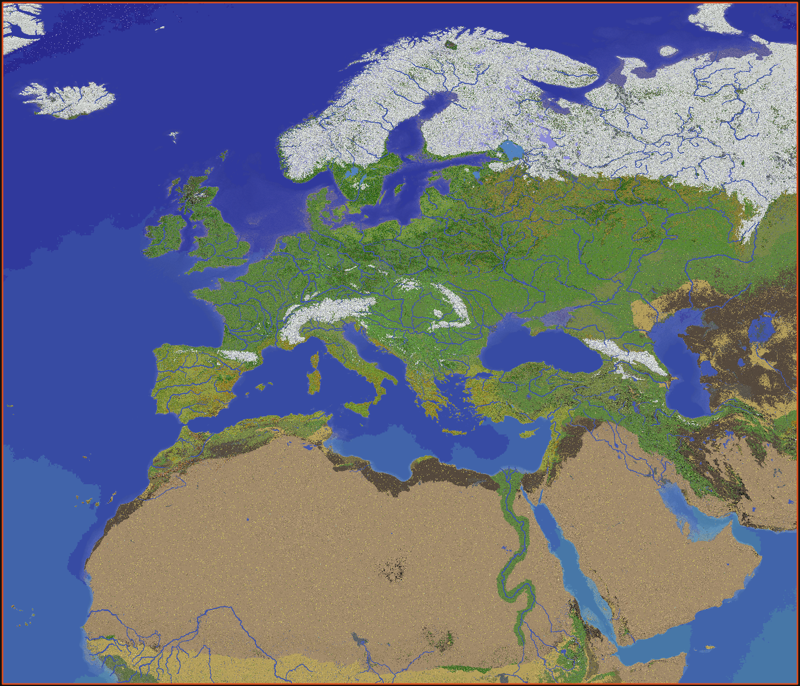
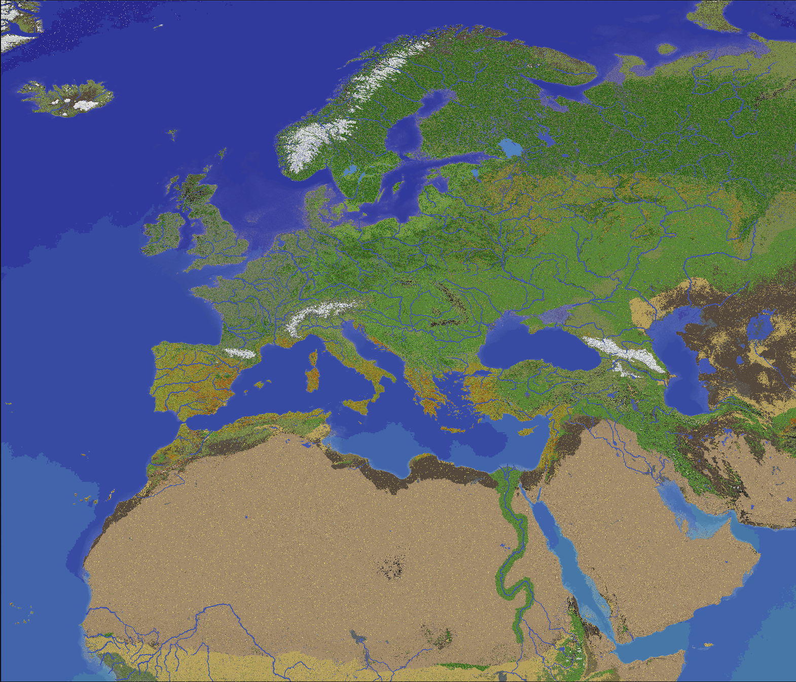
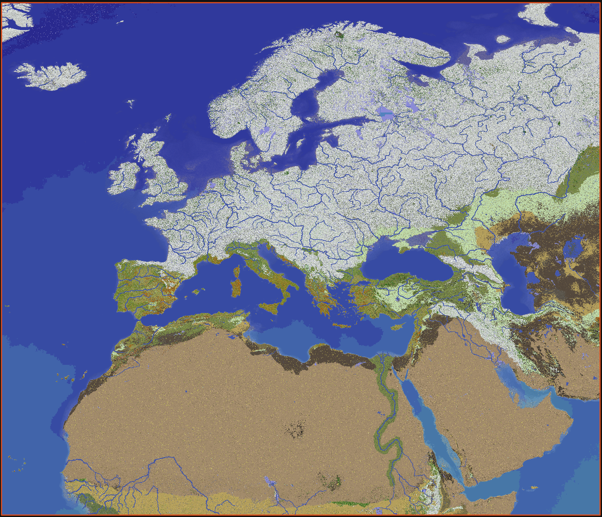

# Mvndicraft IV dev log 3 Map

Since Mvndi III, the map have been redone from 0.
The previous map was good, but it had obvious issues that we couldn't resolve easily such as: part of Iceland missing, low height mountains, unexpected mountains in IRL flatland, old minecraft caves, too small rivers for ships, etc.
We are now using new tools : EarthToMc (2025), Underilla (2024) & MvndiSeasons (2024) which allow us to have a much better map.

**TL:DR** If you just want to see what the map looks like, check the [previews](#previews) section.

## EarthToMc

Our custom version of EarthToMc allows us to extract IRL data as:
- land elevation (Nasa)
- sea ground elevation (Bathymetry gebco)
- land cover (GLC_FCS)
- biomes (Koppen Geiger 1900)
- sea surface temperature (Nasa)
- rivers (OpenStreetMap)
- lakes (OpenStreetMap)
- wetland (OpenStreetMap)
- mangrove (OpenStreetMap)
- glacier (OpenStreetMap)
- beach (OpenStreetMap)
- coral reefs (OpenStreetMap)
- deserts (Global Aridity Index)

All this data are processed by Bash & Python scripts to create a realistic map of 1:200 ratio.
Our scripts do most of the work and provide a better map than we can expect a human hand to do in a lifetime. But they also have some limitations as what to do when some data is missing.

### Rivers
The most noticeable issue was major rivers flowing into the sea. We have enlarged some rivers to allow ships to sail over them. If we have kept the 1:200 ratio, most rivers will be less than 2 blocks wide.
This was done pretty decently by scripts, but some rivers were joining sea at a location where sea was 1 block deep, making it de facto not sailable.
To address that issue, a new script was added to extend the river to the nearest deep ocean. It was working great in most of the cases, but sometimes, it makes river cross mountains to reach the sea by the nearest point instead of following the IRL path of the rivers.
We had to edit major river shapes by hand to fix all those cases and made then smoothly start in the mountains. (Thanks to Nildrif for that)

### Worldpainter

Once the data are collected and processed, we use [WorldPainter](https://github.com/Captain-Chaos/WorldPainter) (Thanks Captain-Chaos) to generate the map. It works a bit like a multilayer painting. We add biomes, rivers and all other stuff by painting areas (with scripts of course) and then we export it to a Minecraft map. Worldpainter does the major part of the job by placing each blocks and biomes into the world.

## Underilla

At this step we have a perfect world surface, but there is still nothing inside the surface, no caves, no ores.
[Underilla](https://github.com/HydrolienF/Underilla) merge our custom map with a Minecraft world. It keeps the 6 top solid blocks of our custom world and under it 1.18+ vanilla caves.

## Datapacks & Seasons

### Caves

In fact, caves are not exactly the vanilla caves.
As Nether is disabled and we still want builders to access as many block types as possible, we added quartz ore to overworld caves.
We also make some ore regional, lapis Lazuli for example can't be found anywhere, you have to go to Persia to find some. Coal is more common near France, Belgium & England coal mines. Please note that for balance purposes, diamonds and irons are still the same all over the map.

There are no caves and no ores under the oceans. Anyways, you're not able to build in the deep oceans, we don't want faction bases in the middle of the Atlantic Ocean.

### Structures

To fit the medieval theme, we disabled most vanilla structures such as Deepdark, mob spawners, etc.
You can still find shipwrecks with custom loots on beaches and in not deep oceans.
2 new structures have been added: Brigant camps & mines. Be prepared to explore these 2 structures, bandits spawn more often there.
Brigand camps are adapted for the region they spawn in: Nomad yurt in steppes and Eastern Europe, Viking longhouses & houses in Scandinavia, Runins and tents in Europe & arabian tents in Middle East and Africa.

### Seasons

Each area of the map has a custom biomes with a specific grass & foliage color and specific mob spawns to make them unique.
Every week, the server switches to a new season. This affects the biomes. Some mob spawns more or less often depending on the seasons. Season also affects temperature and most of Europe will be snowy in winter. Make sure to have enough food before winter to survive.

See [seasons](https://mvndicraft.net/guides/seasons.html) & [temperature](https://mvndicraft.net/guides/temperature.html) to learn more.

## Previews

### Top view with various seasons

#### Snow in Northern Europe & regular leaves and grass colors

#### Fewer snow & dry grass colors

#### Snow in Northern Europe & falling leaves colors

#### Snow in Northern Europe and Central Europe & cold grass and leaves colors

### Random map location previews

#### France

<iframe width="1075" height="450" src="https://www.youtube.com/embed/5Snqpkxn8Tw?si=Y1GPjE_L_yWCSlW0" title="YouTube video player" frameborder="0" allow="accelerometer; autoplay; clipboard-write; encrypted-media; gyroscope; picture-in-picture; web-share" referrerpolicy="strict-origin-when-cross-origin" allowfullscreen></iframe>

#### Norway Fjord

<iframe width="1075" height="450" src="https://www.youtube.com/embed/VpcSNnFTFJs?si=arhblZXvXUsNiDeC" title="YouTube video player" frameborder="0" allow="accelerometer; autoplay; clipboard-write; encrypted-media; gyroscope; picture-in-picture; web-share" referrerpolicy="strict-origin-when-cross-origin" allowfullscreen></iframe>

#### Corsica

<iframe width="1075" height="450" src="https://www.youtube.com/embed/VifHsaEbyjQ?si=IBp9-KuvEc7UylKy" title="YouTube video player" frameborder="0" allow="accelerometer; autoplay; clipboard-write; encrypted-media; gyroscope; picture-in-picture; web-share" referrerpolicy="strict-origin-when-cross-origin" allowfullscreen></iframe>

#### Sahara Tibesti Mountains

<iframe width="1075" height="450" src="https://www.youtube.com/embed/y7ffeotaPc8?si=KQe7s5-6uOkgvLJ7" title="YouTube video player" frameborder="0" allow="accelerometer; autoplay; clipboard-write; encrypted-media; gyroscope; picture-in-picture; web-share" referrerpolicy="strict-origin-when-cross-origin" allowfullscreen></iframe>

More previews will be added [there](https://www.youtube.com/playlist?list=PLWkpCCxr3IBSIR4wUSIs133lTGLazB-iw).

### Effects

There is a cold breath & a sweat effect at low & high temperatures.
<iframe width="1075" height="450" src="https://www.youtube.com/embed/6EUVmEbrNmg?si=KzP-Cczwu-n0LhwM" title="YouTube video player" frameborder="0" allow="accelerometer; autoplay; clipboard-write; encrypted-media; gyroscope; picture-in-picture; web-share" referrerpolicy="strict-origin-when-cross-origin" allowfullscreen></iframe>
<iframe width="1075" height="450" src="https://www.youtube.com/embed/OKgBJl2jpTA?si=xjoTlNew0NVRNdLg" title="YouTube video player" frameborder="0" allow="accelerometer; autoplay; clipboard-write; encrypted-media; gyroscope; picture-in-picture; web-share" referrerpolicy="strict-origin-when-cross-origin" allowfullscreen></iframe>

And some shooting stars in the summer sky.

We will speak about bears, boards, wolves & brigands in another blog.

Thank you for reading and supporting us, if you like getting news about the server, subscribe to our patreon in order to get sneak peaks for upcoming features make sure to make a ticket in the discord when you subscribe to our [patreon](https://www.patreon.com/Mvndicraft). We have set up this patreon to help us cover server costs which are not cheap at all.
