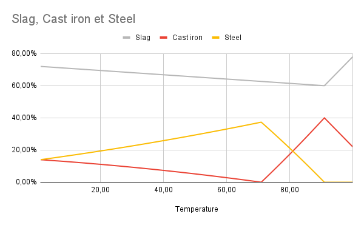

# Blacksmithing

**Important note: You need to have the blacksmith profession to do anything in this guide. You can select a profession by using the `/mp` command.**

## XP Gain

There are a couple of ways to gain XP for the blacksmith profession

1. **Smelting ores**, specifically picking up smelted ingots from a furnace
2. Hammering **bloom**, after picking it up from a bloomery
3. Hammering items crafted from **hot cast iron** and **hot steel** (shown below)

## Creating weapons/armor

### Requirements

- 1 x Anvil (for hammering)
- 1 x Cauldron (for quenching)
- 1 x Smithing Table (for assembling weapons)
- 1 x Hammer
- Raw Iron
- Coal 

### Bloomery

#### Bloomery-specific requirements
- 2 x **Hard Clay** (for bloomery)
- 1 x Bellows
- 1 x Tongs

- Craft and place a bloomery (place two hard clay blocks on top of each other and right click with a hammer).
- Take raw iron (only raw iron works, not ingots) and put it in the bloomery with coal or charcoal.
- Once hot, take it out by right clicking with the tongs item.
- Place the bloom on an anvil and start hitting it with a hammer item.
- Enable fire in your plot `/plot toggle fire on`
- Make a fire with a flint and steel, and throw the new hot ingots in the fire.
- Pick up the ingots with the tongs by right clicking, then with the tongs that have the steel/iron right click the anvil with the tongs.
- In the GUI, select what item to craft.
- Take a hammer and hit it in the circled points on the anvil (play osu).
- Take out the crafted item with the tongs, and put it in a cauldron of water.
- Assemble in smithing table. Smithing table recipes can be found in `/recipes`

Video guide:

<video controls src="https://github.com/Mvndi/docs/raw/refs/heads/main/src/assets/video/blacksmithing.mp4" title="Blacksmithing"></video>

#### Bloomery Temperatures

To change the chance of gaining either steel, slag, or cast iron, you need to set the temperature of your bloomery to one that maximises either slag, cast iron or steel gain. The graph below shows the temperature to chance ratio, directly correlated to the temperature displayed above the bloomery when using the bellows.

- X axis: **chance to gain item**
- Y axis: **temperature set on bloomery**

### Crucible Furnace

- 1x Crucible + Tongs per slot (steel, cast iron, slag)
- 1x Tongs (to pick up casted ingots)
- 1x Ingot Cast
- 1x Blast Furnace
- 1x Clay Block

The max level blacksmith upgrade gives access to the Crucible Furnace. The main difference is that the Crucible Furnace doesn't require any kind of temperature control like the bloomery does, which makes it easier to make steel & cast iron ingots.

- Make the Crucible Furnace by putting a Blast Furnace on the ground, and putting a clay block onto it, and right click it with the hammer
- Combine Tongs & Crucibles to make Tongs with Crucibles.
- Put raw iron & coal into the Crucible Furnace
- Put the Tongs with Crucibles into any of the Crucible Furnace slots
- Wait until they fill up
- Take a pair of Tongs out
- Place down an Ingot Cast onto the ground, then right click the Tongs onto the Ingot Cast
- Once the liquid has solidified, pick it up with a pair of Tongs
- Quench the Tongs to cool down the ingot
- Once you want to use the ingots for crafting, reheat them using fire and pick them up using tongs

<video controls src="https://github.com/Mvndi/docs/raw/refs/heads/main/src/assets/video/crucible.mp4" title="Crucible Furnace"></video>

### Steel Wire
<!-- iframe will be blocked by firefox -->

### Quenching
You can quench any "hot" item you have in Tongs, i.e. ingots, weapon heads, etc.

#### Weapon/Armor Upgrading
- Make sure you have the skill for what you're trying to quench
- Fill a cauldron with water
- Right click cauldron with the weapon/armor you want to quench (you can do this more than once)

### FAQ

#### How do I remove steel/cast iron from tongs?
Quench it, and when you want to use it again, reheat it with fire