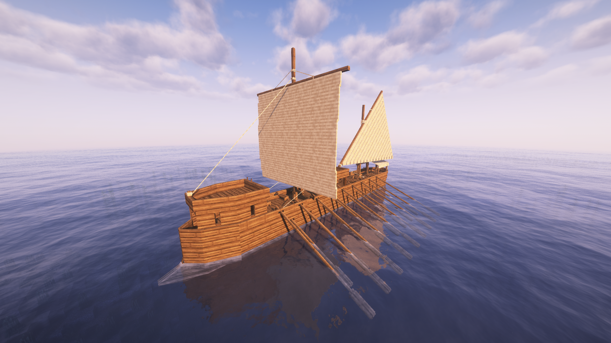

# Dromon

Construction cost of `100,000`, takes 168 hours to construct. Need Seaworthy skill at lvl 3.

## Movement Stats

| Property                  | Value | Unit    | Description |
|---------------------------|-------|---------|-------------|
| Speed                     | 20.0  | m/s     | Maximum speed. |
| Acceleration              | 1.5   | m/s²    | Rate of speed increase. |
| Drag                      | 0.012 | coeff   | Slowdown factor. |
| Angular Speed             | 1.8   | deg/s   | Maximum turning speed. |
| Angular Acceleration      | 2.0   | deg/s²  | Rate of turning increase. |
| Min Speed for Turn        | 0.01  | m/s     | Minimum speed required to turn. |
| Max Turn Effectiveness    | 1.0   | coeff   | Peak turning efficiency. |
| Max Heel                  | 2.5   | deg     | Maximum lean angle during turns. |
| Heel Speed                | 4.5   | -       | Rate of leaning into a turn. |
| Heel Recovery Speed       | 7.5   | -       | Rate of returning to upright. |
| Max Rowing Contribution   | 0.7   | -       | Rowing's share of max speed (e.g., with no rowers and full sails, reaches 30% max speed). |
| Input Type                | ad    | -       | Control scheme (A/D for turning, rowing/sail hybrid forward). |

### Structure Stats

5.0 x 9.0 x 43.0

| HP Section | Value |
|------------|-------|
| Bow        | 13.0  |
| Hull       | 19.0  |
| Mast       | 11.0  |
| Stern      | 15.0  |

The dromon has an inventory with 5 pages, each double chest sized. It has two siege weapon slots on the top middle that can only take ballistas, a third slot at the front that can take either a ballista or Greek fire, and a fourth slot on the top front that can take a ballista. It has a sail and 18 rowing seats.
