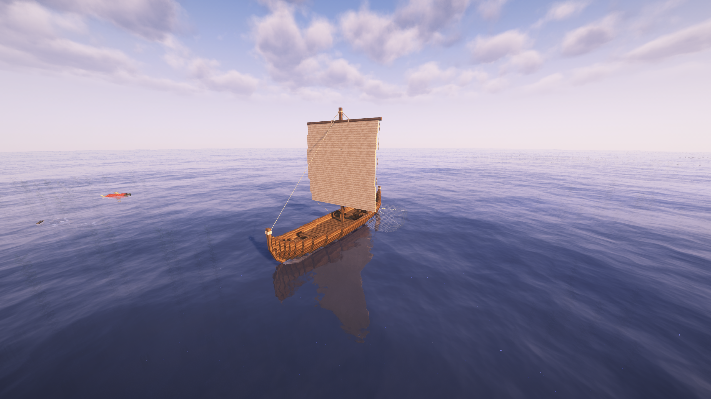

# Fishing Boat

Construction cost of `8,000`, takes 8 hours to construct. Need Naval Strides skill at lvl 1.

## Movement Stats

| Property                  | Value | Unit    | Description |
|---------------------------|-------|---------|-------------|
| Speed                     | 20.0  | m/s     | Maximum speed. |
| Acceleration              | 3.0   | m/s²    | Rate of speed increase. |
| Drag                      | 0.009 | coeff   | Slowdown factor. |
| Angular Speed             | 7.2   | deg/s   | Maximum turning speed. |
| Angular Acceleration      | 5.2   | deg/s²  | Rate of turning increase. |
| Min Speed for Turn        | 0.01  | m/s     | Minimum speed required to turn. |
| Max Turn Effectiveness    | 1.0   | coeff   | Peak turning efficiency. |
| Max Heel                  | 2.5   | deg     | Maximum lean angle during turns. |
| Heel Speed                | 5.3   | -       | Rate of leaning into a turn. |
| Heel Recovery Speed       | 8.3   | -       | Rate of returning to upright. |
| Max Rowing Contribution   | 0.0   | -       | Sail-only propulsion; full sails provide maximum speed without rowers. |
| Input Type                | ad    | -       | Control scheme (A/D for turning, rowing/sail hybrid forward). |

### Structure Stats

Dimensions  | 3.0 x 3.0 x 12.0

| HP Section | Value |
|------------|-------|
| Bow        | 5.0   |
| Hull       | 7.0   |
| Mast       | 3.0   |
| Stern      | 5.0   |

The Fishing Boat has a single chest-sized inventory. It can't store horses and has no siege weapon slots.

## Fishing Net

The fishing net is in /reipces tools section. Place it in the ship inventory before setting sail.

While the boat is moving in a **deep ocean** biome with a fishing net in storage:

- Fish are passively collected into the ship inventory (stacks with existing fish)
- Max speed is reduced by 25%
- The net loses durability over time and breaks when worn out
- Seamen aboard gain profession XP on each catch (the driver earns more than crew)
