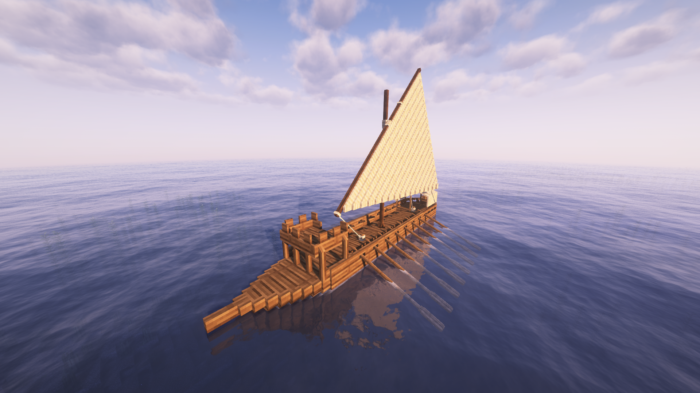

# Galley

Construction cost of 500000, takes 96 hours to construct. Need Galoots skill at lvl 1.

## Movement Stats

| Property                  | Value | Unit    | Description |
|---------------------------|-------|---------|-------------|
| Speed                     | 22.0  | m/s     | Maximum speed. |
| Acceleration              | 1.8   | m/s²    | Rate of speed increase. |
| Drag                      | 0.011 | coeff   | Slowdown factor. |
| Angular Speed             | 2.0   | deg/s   | Maximum turning speed. |
| Angular Acceleration      | 2.2   | deg/s²  | Rate of turning increase. |
| Min Speed for Turn        | 0.01  | m/s     | Minimum speed required to turn. |
| Max Turn Effectiveness    | 1.0   | coeff   | Peak turning efficiency. |
| Max Heel                  | 3.0   | deg     | Maximum lean angle during turns. |
| Heel Speed                | 5.5   | -       | Rate of leaning into a turn. |
| Heel Recovery Speed       | 8.5   | -       | Rate of returning to upright. |
| Max Rowing Contribution   | 0.85  | -       | Rowing's share of max speed (e.g., with no rowers and full sails, reaches 15% max speed). |
| Input Type                | ad    | -       | Control scheme (A/D for turning, rowing/sail hybrid forward). |

### Structure Stats

| Property    | Value           |
|-------------|-----------------|
| Dimensions  | 5.0 x 9.0 x 28.0 |
| Offset      | 0.0, 3.0, 0.0  |

| HP Section | Value |
|------------|-------|
| Bow        | 11.0  |
| Hull       | 16.0  |
| Mast       | 10.0  |
| Stern      | 13.0  |

The galley has no inventory. It has one siege weapon slot in the front that can take a ballista or a cannon. It has a sail and 14 rowing seats.
