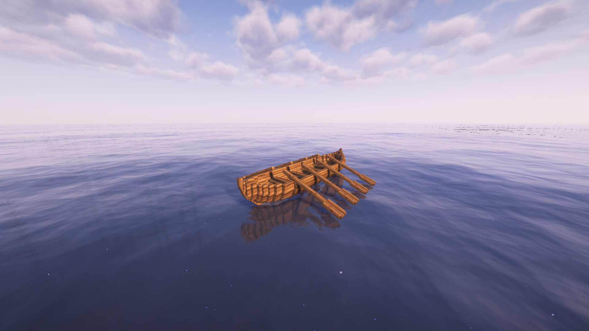

# Rowboat

Construction cost of 5000, takes 1 hour to construct.  Need Rowing Arms skill at lvl 1.

## Movement Stats

(Not Trebuchet capable, sail and no oars/rowing)

| Property                  | Value | Unit    | Description |
|---------------------------|-------|---------|-------------|
| Speed                     | 20.0  | m/s     | Maximum speed. |
| Acceleration              | 2.2   | m/s²    | Rate of speed increase. |
| Drag                      | 0.009  | coeff   | Slowdown factor. |
| Angular Speed             | 15.0  | deg/s   | Maximum turning speed. |
| Angular Acceleration      | 20.0  | deg/s²  | Rate of turning increase. |
| Min Speed for Turn        | 0.01  | m/s     | Minimum speed required to turn. |
| Max Turn Effectiveness    | 1.0   | coeff   | Peak turning efficiency. |
| Max Heel                  | 2.5   | deg     | Maximum lean angle during turns. |
| Heel Speed                | 5.3   | -       | Rate of leaning into a turn. |
| Heel Recovery Speed       | 8.3   | -       | Rate of returning to upright. |
| Max Rowing Contribution   | 1.0   | -       | Rowing's share of max speed (0 means no rowing, fully sail-dependent). |
| Input Type                | ad    | -       | Control scheme (A/D for turning, sail-based forward). |

### Structure Stats

Dimensions  | 2.0 x 3.0 x 8.0

| HP Section | Value |
|------------|-------|
| Bow        | 0.25  |
| Hull       | 0.25  |
| Mast       | 0.25  |
| Stern      | 0.25  |
