# Blacksmith

**Important note: You need to have the blacksmith profession to do anything in this guide. You can select a profession by using the `/mp` command.**

## Quick Navigation

* [Bloomery](#bloomery)
* [Core Blacksmithing](#core-blacksmithing)

## XP Gain

There are a couple of ways to gain XP for the blacksmith profession:

1. **Smelting ores**, specifically picking up smelted ingots from a furnace
2. Hammering **bloom**, after picking it up from a bloomery
3. Hammering items crafted from **hot cast iron** and **hot steel**

## Skill Tree

The blacksmith profession contains several skills that unlock new equipment, siege weapons, and improvements to forged gear.

### Full Skill Tree

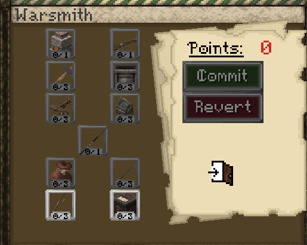

---

### Fletching

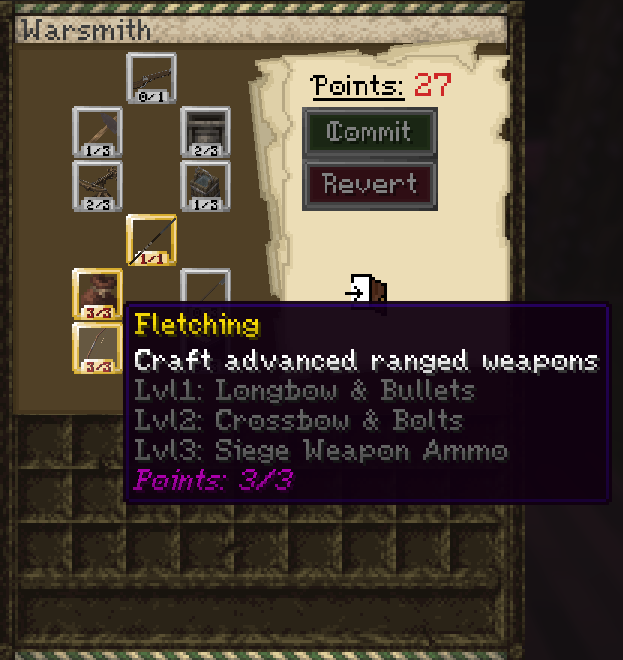

Craft advanced ranged weapons.

Lvl 1: Longbow & Bullets  g
Lvl 2: Crossbow & Bolts  
Lvl 3: Siege Weapon Ammo

This skill unlocks advanced ranged weapon crafting and their ammunition.

---

### Armor Smithing

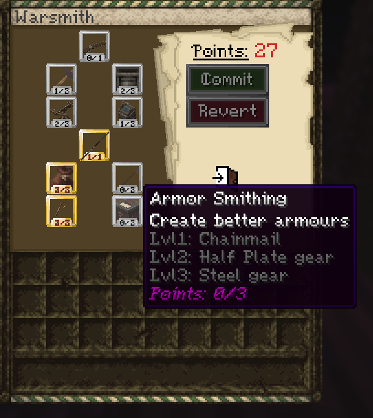

Create stronger armor pieces.

Lvl 1: Chainmail  
Lvl 2: Half Plate gear  
Lvl 3: Steel gear

This skill unlocks progressively better armor types.

---

### Backpacking

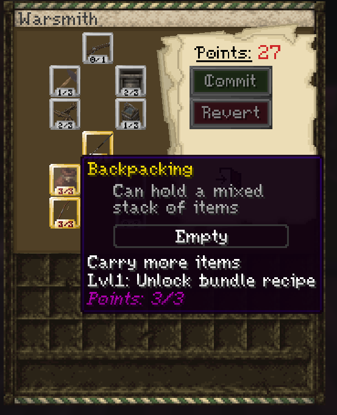

Allows carrying mixed stacks of items.

Lvl 1: Unlock bundle recipe.

This skill unlocks the bundle recipe for carrying more mixed items.

---

### Weapon Smithing

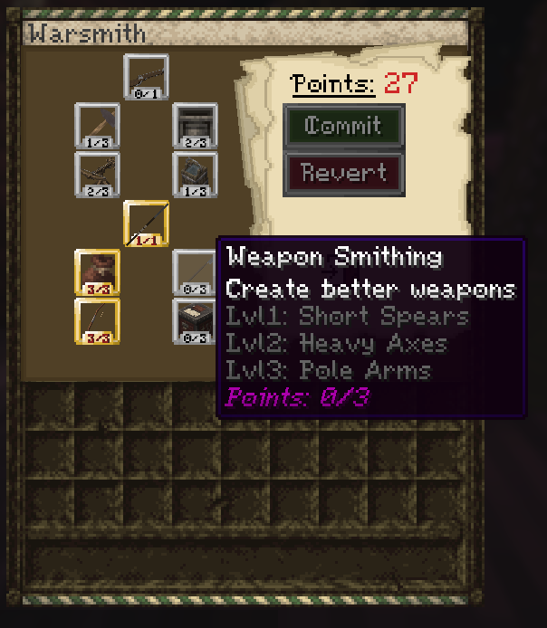

Unlocks more advanced melee weapons.

Lvl 1: Short Spears  
Lvl 2: Heavy Axes  
Lvl 3: Pole Arms

This skill unlocks progressively stronger melee weapon types.

---

### The Handgonne

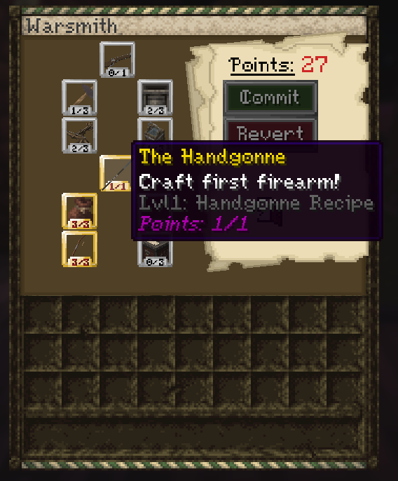

Unlocks the first firearm.

Lvl 1: Handgonne recipe.

This skill gives access to the Handgonne recipe.

---

### Warsmithing

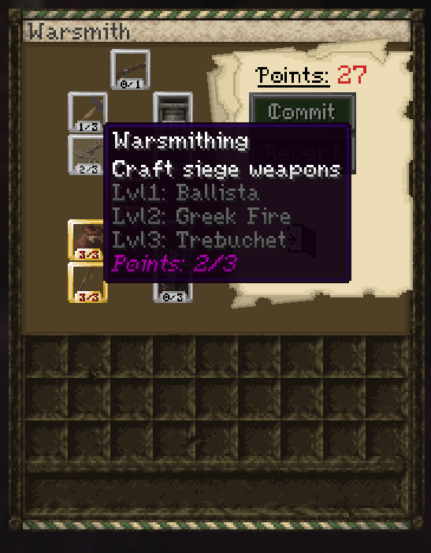

Allows the crafting of siege weapons.

Lvl 1: Ballista  
Lvl 2: Greek Fire  
Lvl 3: Trebuchet

This skill unlocks siege weapon crafting.

---

### Armor Quenching

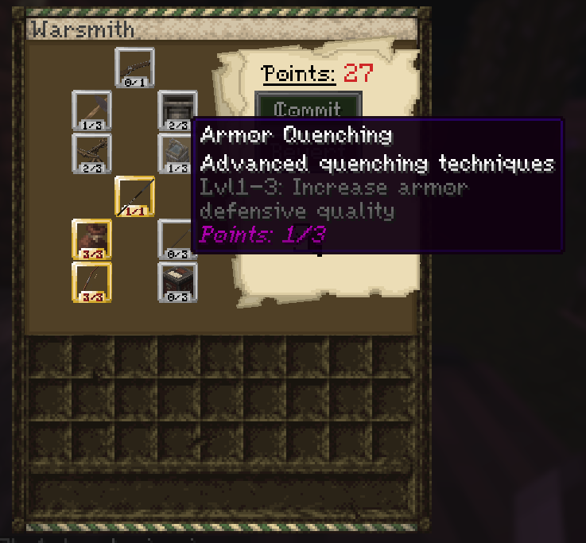

Advanced quenching techniques for armor pieces.

Lvl 1–3: Increases armor defensive quality.

To upgrade armor through quenching:

* Make sure you have the Armor Quenching skill
* Fill a cauldron with water
* Right click the cauldron with the armor piece you want to quench
* This can be done more than once

Quenching armor gives bonus defense based on level:

* Level 1 = x1.1
* Level 2 = x1.2
* Level 3 = x1.3

You can quench any "hot" item held in tongs, such as ingots or armor pieces.

---

### Durable Siegeworking

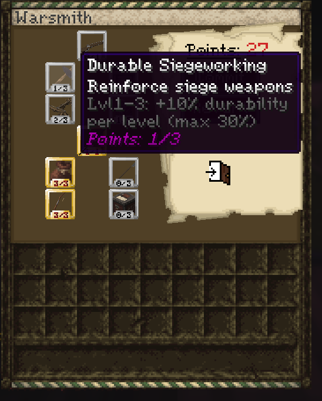

Reinforces siege weapons.

Lvl 1–3: +10% durability per level (max 30%).

This skill increases siege weapon durability by 10% per level, up to 30%.

---

### Weapon Quenching

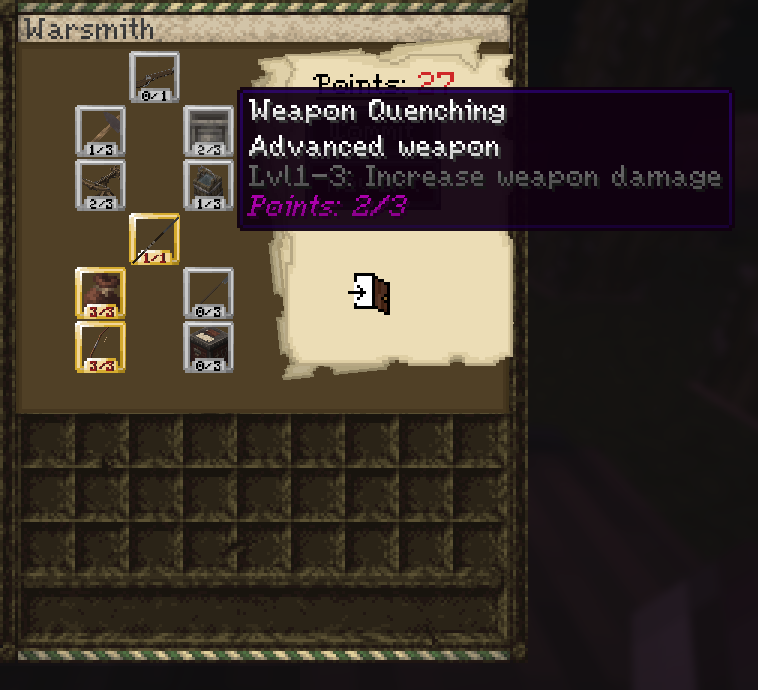

Advanced weapon quenching techniques.

Lvl 1–3: Increases weapon damage.

To upgrade weapons through quenching:

* Make sure you have the Weapon Quenching skill
* Fill a cauldron with water
* Right click the cauldron with the weapon or weapon part you want to quench
* This can be done more than once

Quenching weapons gives bonus damage based on level:

* Level 1 = x1.1
* Level 2 = x1.2
* Level 3 = x1.3

You can quench any "hot" item held in tongs, such as ingots or weapon heads.

---

### True Smithing

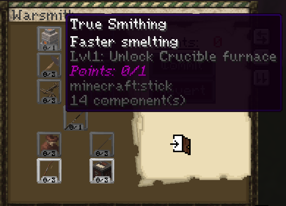

Faster smelting.

Lvl 1: Unlock Crucible Furnace

### Crucible Furnace

#### Crucible Furnace-specific requirements

- 1 x Crucible + Tongs per slot (steel, cast iron, slag)
- 1 x Tongs (to pick up cast ingots)
- 1 x Ingot Cast
- 1 x Blast Furnace
- 1 x Clay Block

**Important: To use a Crucible Furnace, you need the True Smithing skill from the Blacksmith skill tree.**

#### Guide

The True Smithing skill gives access to the **Crucible Furnace**.

The main advantage of the Crucible Furnace is that it does not require temperature control like the bloomery does. This makes it a simpler way to produce **steel** and **cast iron** ingots. It can also process **slag**, so slag is no longer just a waste byproduct from the bloomery.

To create and use a Crucible Furnace:

- Place a **Blast Furnace** on the ground
- Place a **Clay Block** on top of it
- Right click it with a **hammer**
- Combine **Tongs** and **Crucibles** to make **Tongs with Crucibles**
- Put **raw iron** and **coal** into the Crucible Furnace
- Put the **Tongs with Crucibles** into any of the Crucible Furnace slots
- Wait until they fill up
- Take out a pair of tongs
- Place an **Ingot Cast** on the ground
- Right click the tongs onto the Ingot Cast
- Wait for the liquid to solidify
- Pick up the finished ingot with tongs
- Quench the tongs to cool the ingot
- When you want to use the ingot for crafting, reheat it in fire and pick it up again with tongs

Video guide:

<video controls src="https://github.com/Mvndi/docs/raw/refs/heads/main/src/assets/video/crucible.mp4" title="Crucible Furnace"></video>

---

### Quality Steelworking

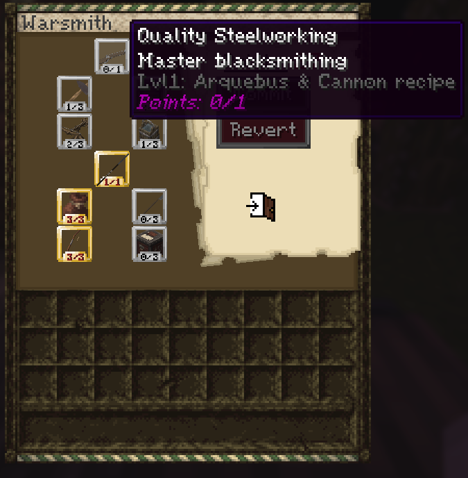

Master blacksmithing skill.

Lvl 1: Arquebus & Cannon recipe.

This skill unlocks the Arquebus and Cannon recipes.

---

## Core Blacksmithing

### Requirements

* 1 x Anvil (for hammering)
* 1 x Cauldron (for quenching)
* 1 x Smithing Table (for assembling weapons)
* 1 x Hammer
* Raw Iron
* Coal

### Bloomery

#### Bloomery-specific requirements

* 2 x **Hard Clay** (for bloomery)
* 1 x Bellows
* 1 x Tongs

#### Guide

* Craft and place a bloomery by placing two hard clay blocks on top of each other and right clicking with a hammer
* Take raw iron, not ingots, and put it in the bloomery with coal or charcoal
* Once hot, take it out by right clicking with the tongs item
* Place the bloom on an anvil and start hitting it with a hammer
* Enable fire in your plot with `/plot toggle fire on`
* Make a fire with flint and steel, then throw the new hot ingots into the fire
* Pick up the ingots with tongs by right clicking
* With the tongs holding the hot steel or iron, right click the anvil
* In the GUI, select what item to craft
* Take a hammer and hit the circled points on the anvil to complete the smithing minigame
* Take out the crafted item with the tongs and place it in a cauldron of water
* Assemble the final item in a smithing table
* Smithing table recipes can be found in `/recipes`

The highest grade is 4 stars, and the highest quality is Excellent.

Video guide:

<video controls src="https://github.com/Mvndi/docs/raw/refs/heads/main/src/assets/video/blacksmithing.mp4" title="Blacksmithing"></video>

#### Bloomery Temperatures

To change the chance of gaining either steel, slag, or cast iron, you need to set the temperature of your bloomery to one that maximises either slag, cast iron, or steel gain. The graph below shows the temperature to chance ratio, directly correlated to the temperature displayed above the bloomery when using the bellows.

* X axis: **temperature set on bloomery**
* Y axis: **chance to gain item**

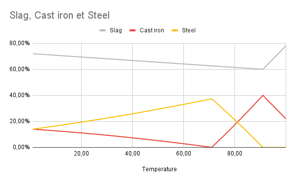

### Steel Wire

Video guide:

<video controls src="https://github.com/Mvndi/docs/raw/refs/heads/main/src/assets/video/steel_wire.mp4" title="Steel Wire"></video>

### Smithing Table Bonus and Debuff

* `quality` is between 0 and 1, based on how well you complete the hammer minigame
  * quality > 0.95 = **excellent**
  * quality > 0.85 = **good**
  * quality > 0.7 = **fine**
  * quality > 0.5 = **poor**
  * otherwise = **terrible**

* `grade` is an integer between 0 and 3, based on difficulty
  * highest difficulty = grade 3 / 4 stars
  * lowest difficulty = grade 0 / 1 star

The **multiplier** is calculated as:

$$
\text{multiplier} = \text{quality} \times (1 + \text{grade} \times 0.1)
$$

A perfect hammer minigame with quality = 1 on highest difficulty with grade = 3 gives:

$$
1 \times (1 + 3 \times 0.1) = 1 \times 1.3 = 1.3
$$

The number shown after the **+** is the bonus damage:

$$
\text{bonus} = (\text{baseDamage} \times \text{multiplier}) - \text{baseDamage}
$$

or equivalently:

$$
\text{bonus} = \text{baseDamage} \times (\text{multiplier} - 1)
$$

So with a perfect 1.3× multiplier you get +30% of base damage.

For armor, it takes the average of this calculation for each of the armor plates used to craft the armor.

### Reworking

If you get a bad minigame result, you can throw the weapon head, blade, or armor plate back into a fire like an ingot, pick it up in your tongs, place it back on an anvil, and reattempt the minigame.

* First retry: -75% XP
* Second retry: -100% XP
