# Farmer

**Important note: You need to have the farmer profession to use the abilities in this guide. You can select a profession by using the `/mp` command.**

## XP Gain

The farmer profession gains XP from breaking fully grown crops such as wheat, cabbage, carrots, and other harvestable plants.

## Skill Tree

The farmer profession contains several skills that improve harvesting, crop management, herbs, machines, and food production.

### Full Skill Tree

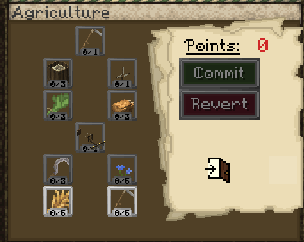

---

### Bountiful Harvest

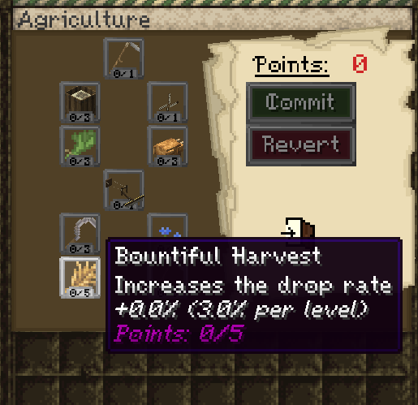

Increases the drop rate from harvested crops.

+3% per level  
Maximum bonus: +15%

---

### Scythe Maintenance

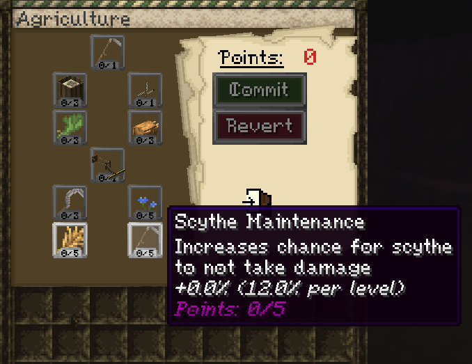

Increases the chance for a scythe to not take damage.

+12% per level  
Maximum bonus: +60%

---

### Sickle Looting

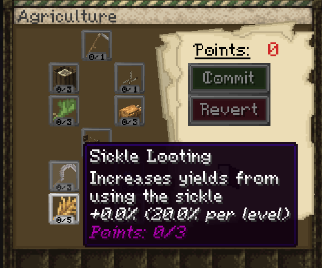

Increases yields from using the sickle.

+20% per level  
Maximum bonus: +60%

---

### Flax

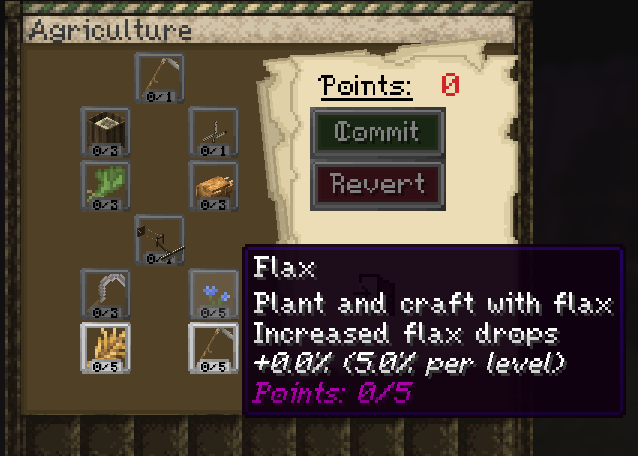

Unlocks flax planting and crafting, and increases flax drops.

+5% flax drops per level  
Maximum bonus: +25%

---

### Plough

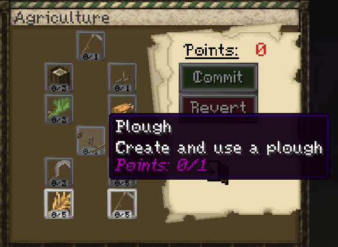

Create and use a plough.

---

### Herbalism

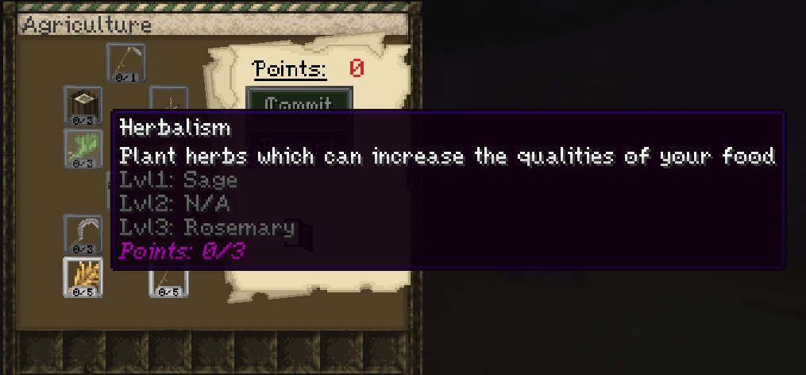

Plant herbs which can increase the qualities of your food.

Lvl 1: Sage  
Lvl 2: N/A  
Lvl 3: Rosemary

---

### Chef

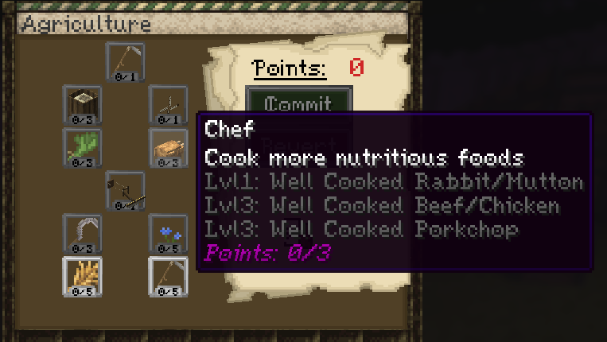

Cook more nutritious foods.

Lvl 1: Well Cooked Rabbit/Mutton  
Lvl 2: Well Cooked Beef/Chicken  
Lvl 3: Well Cooked Porkchop

---

### Pre Industrial

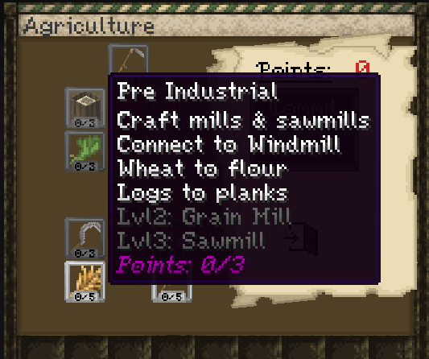

Craft mills and sawmills and connect them to a windmill.

Wheat to flour  
Logs to planks  
Lvl 2: Grain Mill  
Lvl 3: Sawmill

---

### Wind Power

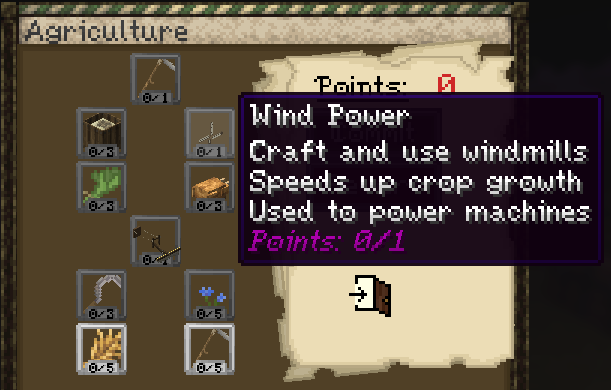

Craft and use windmills.

Speeds up crop growth  
Used to power machines

---

### Crop Reaper

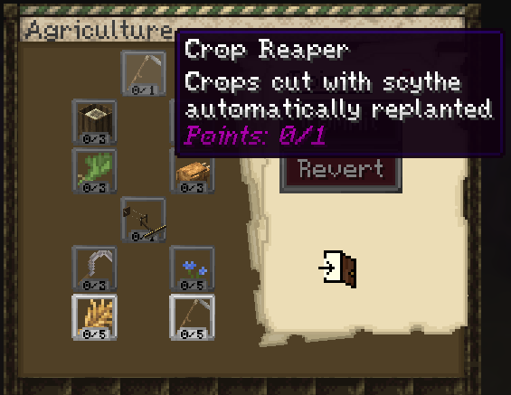

Crops cut with a scythe are automatically replanted.

---

## Seedbags

Seedbags work similarly to bundles, but are made for storing seeds. They were added before vanilla bundles.

To use them, place the seedbag into a crafting table with seeds.

## Flax and Herbalism

If you have the correct skill unlocked, you can get special seeds by breaking normal foliage.

- **Flax**: break foliage to get flax seeds
- **Sage**: break foliage to get sage seeds
- **Rosemary**: break foliage to get rosemary seeds

Flax seeds can also be obtained by breaking **blue flax flowers** with a **scythe**.

To plant them, right click grass with the seeds.

Video guide:

<!-- Add flax and herbalism video here -->
<!-- Example:
<video controls src="VIDEO_LINK_HERE" title="Flax and Herbalism"></video>
-->

## Ploughs

To attach a plough:

- Use a **tamed donkey**
- The donkey must be **saddled**
- Hold **Shift** and **right click** the donkey to attach the plough
- You must have the Plough skill unlocked

Ploughing only works in claimed chunks belonging to your town.

Video guide:

<!-- Add plough video here -->
<!-- Example:
<video controls src="VIDEO_LINK_HERE" title="Plough"></video>
-->

## Windmills

Windmills increase the growth speed of crops within a **3 x 3 chunk radius**.

They are also used to power farmer machines.

## Machines

Machines require the **Pre Industrial** skill from the Farmer skill tree.

Machines must be connected to a generator such as a **windmill**.

After every server restart, machines need to be reconnected manually by right clicking them with a **wrench**.

Current machine functions shown in the skill tree:

- **Grain Mill**: wheat to flour
- **Sawmill**: logs to planks

Video guide:

<video controls src="https://github.com/Mvndi/docs/raw/refs/heads/main/src/assets/video/machines.mp4" title="Machines"></video>

## Crop Reaper

Crop Reaper causes crops cut with a scythe to be automatically replanted. This makes harvesting large fields faster and reduces the need to replant by hand.

## FAQ

#### How do I get flax, sage, or rosemary seeds?

Break normal foliage after unlocking the relevant skill. Flax seeds can also be obtained by breaking blue flax flowers with a scythe.

#### How do I use a plough?

Use a tamed, saddled donkey, then hold Shift and right click to attach the plough. It only works in claimed chunks belonging to your town.

#### What powers farmer machines?

Farmer machines are powered by windmills.

#### Why are my machines not working after a restart?

They need to be reconnected to their windmill by right clicking them with a wrench.
