# Herdsman

**Important note: You need to have the herdsman profession to use the abilities in this guide. You can select a profession by using the `/mp` command.**

## XP Gain

There are a couple of ways to gain XP for the herdsman profession:

1. **Breeding animals**  
   For horses, you can use hay bales and the horses must be tamed.
2. **Hunting domestic mobs** such as cows, sheep, and pigs
3. **Shearing sheep**
4. **Milking Cows**

## Skill Tree

The herdsman profession contains several skills that improve animal products, breeding, fishing, carts, and animal genetics.

### Full Skill Tree

---

### Butcher

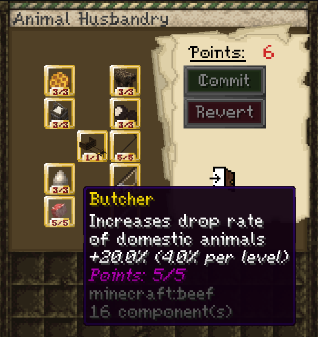

Increases drop rate of domestic animals.

+4% per level  
Maximum bonus: +20%

This skill increases drops from domestic animals such as cows, sheep, and pigs.

---

### Scavenger

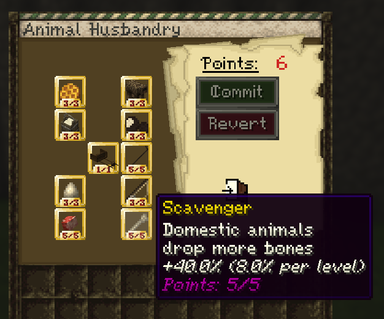

Domestic animals drop more bones.

+8% per level  
Maximum bonus: +40%

This skill increases bone drops from domestic animals.

---

### Hatchery

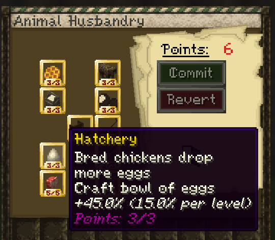

Breed chickens and get more eggs.

Craft bowl of eggs  
+15% per level  
Maximum bonus: +45%

This skill increases egg drops from chickens and unlocks the bowl of eggs crafting recipe.

---

### Fishmonger

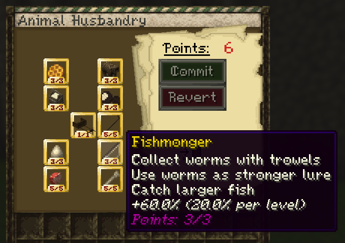

Collect worms with trowels.  
Use worms as stronger lure.  
Catch larger fish.

+20% per level  
Maximum bonus: +60%

To collect worms, right click **grass blocks** with a **trowel** while it is **raining**.

When fishing, hold a **worm in your offhand** while using a fishing rod. There is a random chance to start a fishing minigame. When it starts, a bar appears at the top of the screen. You need to right click and fill the bar within the time limit to win the minigame and receive a better fish.

<!-- Add fishmonger video here -->
<!-- Example:
<video controls src="VIDEO_LINK_HERE" title="Fishmonger"></video>
-->

---

### Horsepower

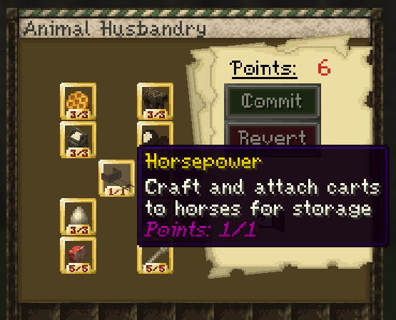

Craft and attach carts to horses for storage.

To attach a cart:

- Use a **tamed donkey or horse**
- The animal must be **saddled**
- Hold **Shift** and **right click** the animal to attach the cart
- You must have the Horsepower skill unlocked
- Once cart is attached, shift right click the animal to access the cart storage

Video guide:

<video controls src="https://github.com/Mvndi/docs/raw/refs/heads/main/src/assets/video/cart.mp4" title="cart"></video>

---

### Shepherd

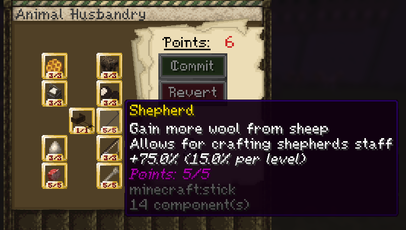

Gain more wool from sheep.  
Allows for crafting shepherd's staff.

+15% per level  
Maximum bonus: +75%

The shepherd's staff makes sheep follow you while you are holding it.

This skill also increases wool gain from sheep.

---

### Dairy

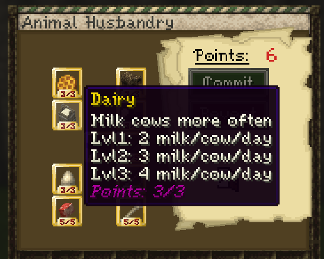

Milk cows more often.

Lvl 1: 2 milk per cow per day  
Lvl 2: 3 milk per cow per day  
Lvl 3: 4 milk per cow per day

This skill increases how many times each cow can be milked per day.

---

### Truffle Hunter

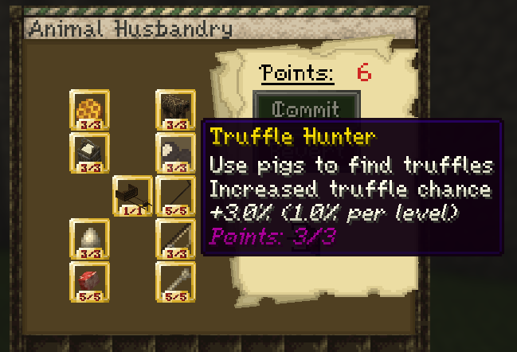

Use pigs to find truffles.

Increased truffle chance  
+1% per level  
Maximum bonus: +3%

To start the truffle minigame, leash a pig. The pig will begin moving in the direction of nearby truffles. You then need to find them by right clicking the ground.

Eating a truffle gives **Speed for 10 seconds**.

Video guide:

<video controls src="https://github.com/Mvndi/docs/raw/refs/heads/main/src/assets/video/truffle.mp4" title="truffle"></video>

---

### Beekeeper

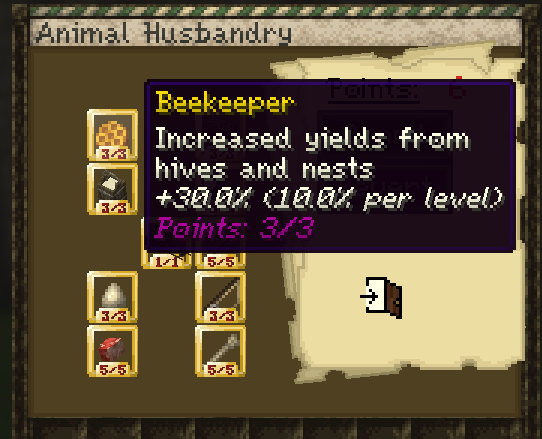

Increased yields from hives and nests.

+10% per level  
Maximum bonus: +30%

This skill increases how much you get from beehives and bee nests.

---

### Artificial Selection

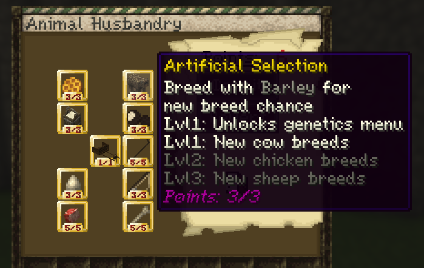

Breed with barley for new breed chance.

Lvl 1: Unlocks genetics menu  
Lvl 1: New cow breeds  
Lvl 2: New chicken breeds  
Lvl 3: New sheep breeds

To work with cow, sheep, and chicken genetics, the animals must be bred with **barley**. Then you can **Shift + right click** them to open the genetics menu. They do not need to be babies.

The temperature where cows are bred affects their genetics, along with some randomness.

You can also get **barley seeds** randomly when breaking wheat if you have the relevant skill unlocked.

## Horse Genetics

To open the horse genetics menu, you need the relevant herdsman skill and must **Shift + right click a baby horse with an empty hand**.

Most of the stats are self explanatory, but **bravery** decreases the chance for the horse to rear when taking damage.

Feeding baby horses changes different stats:

- **Apples** increase health
- **Barley and Wheat** increases jump
- **Sugar** increases speed
- **Horse hay bale blocks** increase bravery

Video guide:

<video controls src="https://github.com/Mvndi/docs/raw/refs/heads/main/src/assets/video/genetics.mp4" title="genetics"></video>

---

### Trapper

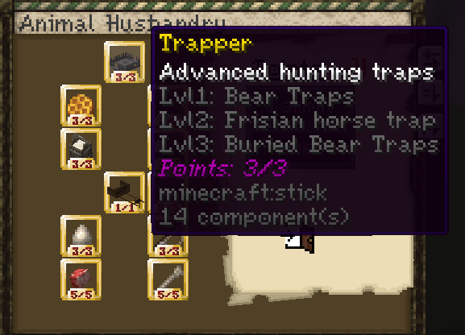

Advanced hunting traps.

Lvl 1: Bear Traps  
Lvl 2: Frisian horse trap  
Lvl 3: Buried Bear Traps

#### Bear Trap

Place the bear trap on the ground, then use a **shovel** to bury it and conceal it.

Players or mobs that step on it will take damage and be temporarily immobilized.

#### Frisian Horse Trap

To make a Frisian horse trap:

- Place **two logs** next to each other
- Place **two log slabs** on top of them
- Right click one of the logs with an **axe**

Video guide:

<video controls src="https://github.com/Mvndi/docs/raw/refs/heads/main/src/assets/video/traps.mp4" title="Traps"></video>
