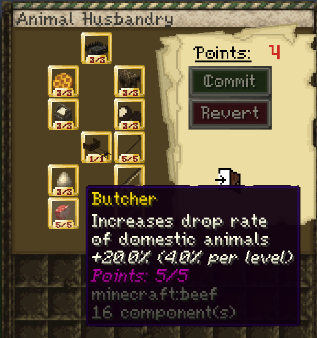
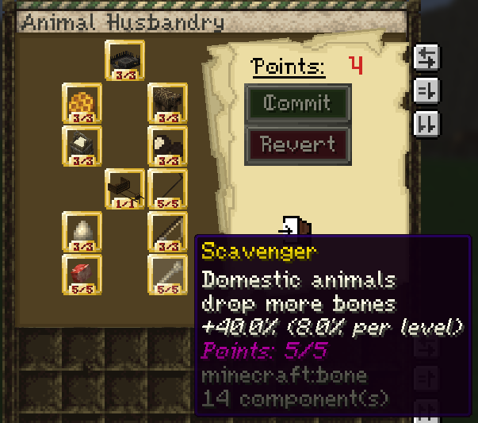
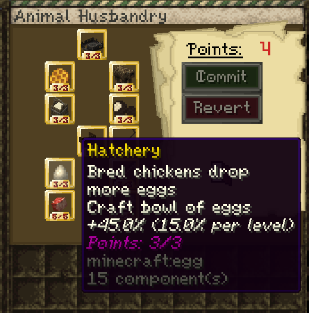
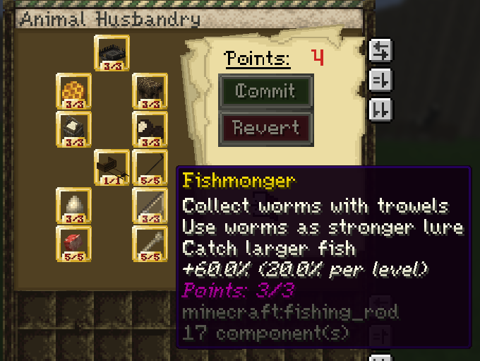
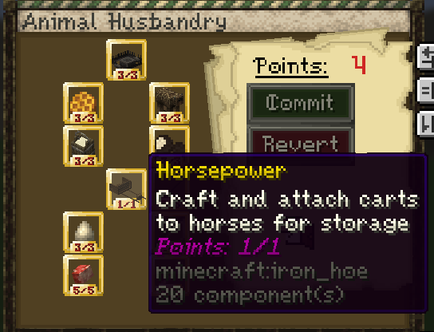
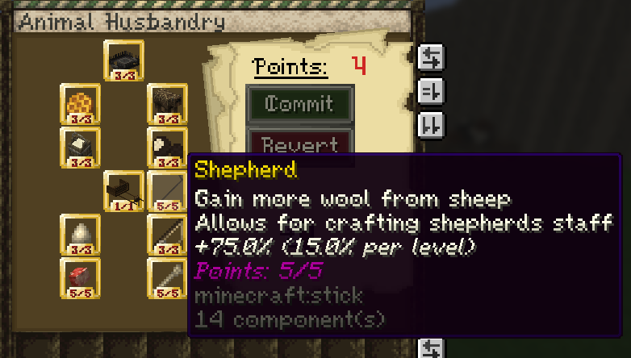
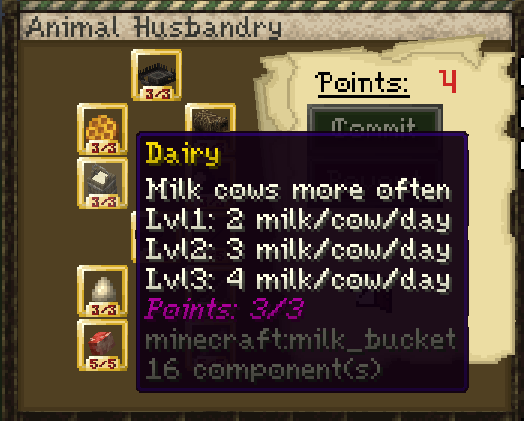
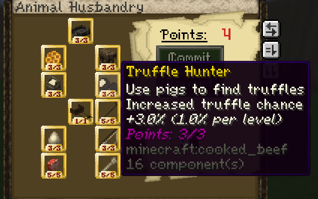
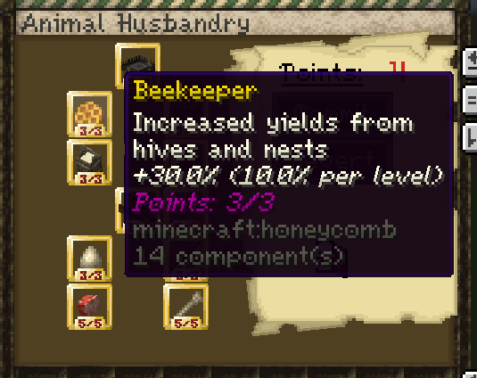
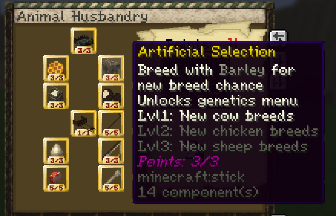

# Herdsman

**Important note: You need to have the herdsman profession to use the abilities in this guide. You can select a profession by using the `/mp` command.**

## XP Gain

There are a couple of ways to gain XP for the herdsman profession:

1. **Breeding animals**  
   For horses, you can use hay bales and the horses must be tamed.
2. **Hunting domestic mobs** such as cows, sheep, and pigs
3. **Shearing sheep**
4. **Milking Cows**

## Skill Tree

The herdsman profession contains several skills that improve animal products, breeding, fishing, carts, and animal genetics.

### Full Skill Tree


---

### Butcher



Increases drop rate of domestic animals.

+4% per level  
Maximum bonus: +20%

This skill increases drops from domestic animals such as cows, sheep, and pigs.

---

### Scavenger



Domestic animals drop more bones.

+8% per level  
Maximum bonus: +40%

This skill increases bone drops from domestic animals.

---

### Hatchery



Breed chickens and get more eggs.

Craft bowl of eggs  
+15% per level  
Maximum bonus: +45%

This skill increases egg drops from chickens and unlocks the bowl of eggs crafting recipe.

---

### Fishmonger



Collect worms with trowels.  
Use worms as stronger lure.  
Catch larger fish.

+20% per level  
Maximum bonus: +60%

To collect worms, right click **grass blocks** with a **trowel** while it is **raining**.

When fishing, hold a **worm in your offhand** while using a fishing rod. There is a random chance to start a fishing minigame. When it starts, a bar appears at the top of the screen. You need to right click and fill the bar within the time limit to win the minigame and receive a better fish.

<!-- Add fishmonger video here -->
<!-- Example:
<video controls src="VIDEO_LINK_HERE" title="Fishmonger"></video>
-->

---

### Horsepower



Craft and attach carts to horses for storage.

To attach a cart:

- Use a **tamed donkey or horse**
- The animal must be **saddled**
- Hold **Shift** and **right click** the animal to attach the cart
- You must have the Horsepower skill unlocked
- Once cart is attached, shift right click the animal to access the cart storage

Video guide:

<video controls src="https://github.com/Mvndi/docs/raw/refs/heads/main/src/assets/video/cart.mp4" title="cart"></video>

---

### Shepherd



Gain more wool from sheep.  
Allows for crafting shepherd's staff.

+15% per level  
Maximum bonus: +75%

The shepherd's staff makes sheep follow you while you are holding it.

This skill also increases wool gain from sheep.

---

### Cheese



## Short Version

1. Join the Herdsman profession.
2. Put at least 1 point into Cheese Making.
3. Collect milk with empty buckets.
4. Get rennet from cows, sheep, or goats.
5. Build a cheese vat with a cauldron over fire or a campfire.
6. Add milk, add rennet, then stir with a stick until curds form.
7. Craft and place a Cheese Press.
8. Put curds into the press, start it with a clock, then unlock it with a stick after the target time.
9. Eat the fresh cheese or age it in a Cheese Cellar.

## Requirements

You need Herdsman to use the custom milking system. You also need at least 1 point in Cheese Making before animals can be milked.

| Level | Unlock |
| --- | --- |
| 1 | Milk animals and make curds |
| 2 | Make fresh cheeses |
| 3 | Age fresh cheeses |

## Getting Milk

Hold an empty bucket and right click one of these animals:

| Animal | Milk item | Milk capacity | Regeneration time |
| --- | --- | ---: | --- |
| Cow | Cow's Milk | 2-3 | 10-20 minutes |
| Sheep | Sheep's Milk | 1-2 | 13m 20s-23m 20s |
| Goat | Goat's Milk | 1-2 | 11m 40s-21m 40s |
| Horse | Mare's Milk | 1-2 | 20m-33m 20s |
| Donkey | Donkey's Milk | 1 | 25m-41m 40s |

Each animal stores its own milk. If one is dry, wait for it to regenerate.

## Getting Rennet

Rennet is a custom leather item. Cows, sheep, and goats have a 25% chance to drop it when they die.

You need 1 rennet per vat of milk.

## Making Curds

Make a vat by placing a cauldron directly above one of these:

| Valid heat source |
| --- |
| Fire |
| Soul Fire |
| Campfire |
| Soul Campfire |

Use it in this order:

1. Right click the heated cauldron with a milk bucket.
2. Right click the vat with rennet.
3. Right click the vat with a stick to stir it.
4. Keep stirring until the curds appear.

Different milks give different curds:

| Milk | Stirs needed | Curds produced |
| --- | ---: | ---: |
| Cow | 4 | 8 Cow Curds |
| Sheep | 5 | 6 Sheep Curds |
| Goat | 3 | 6 Goat Curds |
| Horse | 4 | 5 Horse Curds |
| Donkey | 3 | 4 Donkey Curds |

After the curds are made, the vat turns back into an empty cauldron.

## Crafting the Cheese Press

Craft the Cheese Press with this shaped recipe:

```text
 P 
 S 
 B 
```

Where:

| Symbol | Ingredient |
| --- | --- |
| P | Any plank |
| S | Stick |
| B | Barrel |

## Pressing Curds Into Fresh Cheese

1. Right click the Cheese Press to open it.
2. Put curds inside. A press can only handle one curds type at a time.
3. Close the inventory.
4. Right click the press with a clock to start pressing.
5. Right click the press with a clock again if you want to check elapsed time.
6. Right click the press with a stick to unlock it.

Unlocking too early gives the curds back. Unlocking close to the target time gives better quality. 

| Cheese | Curds | Curds needed | Target press time | Fresh output |
| --- | --- | ---: | ---: | --- |
| Brie | Cow | 6 | 200s | Fresh Brie |
| Cheddar | Cow | 8 | 300s | Fresh Cheddar |
| Gloucester | Cow | 7 | 320s | Single Gloucester |
| Pecorino | Sheep | 6 | 400s | Fresh Pecorino |
| Manchego | Sheep | 7 | 420s | Fresh Manchego |
| Chevre | Goat | 6 | 240s | Fresh Chevre |

Horse and donkey curds exist, but there are no pressed cheese recipes for them right now.

## Cheese Quality

Fresh cheese quality comes from timing the press well.

| Timing result | Quality |
| --- | --- |
| Very close to target | 5 stars |
| Close to target | 4 stars |
| Somewhat close | 3 stars |
| Barely close | 2 stars |
| Outside the best timing window, but still valid | 1 star |

Too early returns the curds. Very late can still make cheese, but usually at low quality. If multiple cheeses use the same curds, the press picks the recipe closest to your timing.

## Making a Cheese Cellar

To make one:

1. Place a chest.
2. Attach a wall sign directly to the chest.
3. Put this exact text on the first line:

```text
[Cheese Cellar]
```

Once the sign is accepted, the chest is a Cheese Cellar.

Put fresh or already aged cheese inside. Aging starts when the cellar inventory is processed, usually when it is opened or closed. Right click the cellar chest with a clock to check progress.

Taking cheese out clears its aging timer. Put it back in to start aging again.

## Aging Recipes

| Base cheese | Aging time | Aged output |
| --- | ---: | --- |
| Cheddar | 600s | Mild Cheddar |
| Cheddar | 1800s | Mature Cheddar |
| Cheddar | 3600s | Clothbound Cheddar |
| Gloucester | 900s | Young Gloucester |
| Gloucester | 2400s | Double Gloucester |
| Brie | 600s | Young Brie |
| Brie | 1800s | Ripe Brie |
| Pecorino | 1200s | Pecorino Fresco |
| Pecorino | 3600s | Pecorino Romano |
| Manchego | 1500s | Semi-Curado Manchego |
| Manchego | 4000s | Curado Manchego |
| Chevre | 600s | Crottin |
| Chevre | 1600s | Chevre Affine |

Each cheese has a preferred age. Hitting that stage can raise quality by 1 star. Nearby stages keep the same quality. Aging too far past the preferred stage can lower it.

## Eating Cheese

Eating fresh or aged cheese gives player XP. Better cheese gives more XP.

| Stars | XP multiplier |
| ---: | ---: |
| 1 | 0.5x |
| 2 | 0.75x |
| 3 | 1.0x |
| 4 | 1.25x |
| 5 | 1.5x |

---

### Truffle Hunter



Use pigs to find truffles.

Increased truffle chance  
+1% per level  
Maximum bonus: +3%

To start the truffle minigame, leash a pig. The pig will begin moving in the direction of nearby truffles. You then need to find them by right clicking the ground.

Eating a truffle gives **Speed for 10 seconds**.

Video guide:

<video controls src="https://github.com/Mvndi/docs/raw/refs/heads/main/src/assets/video/truffle.mp4" title="truffle"></video>

---

### Beekeeper



Increased yields from hives and nests.

+10% per level  
Maximum bonus: +30%

This skill increases how much you get from beehives and bee nests.

---

### Artificial Selection



Breed with barley for new breed chance.

Lvl 1: Unlocks genetics menu  
Lvl 1: New cow breeds  
Lvl 2: New chicken breeds  
Lvl 3: New sheep breeds

To work with cow, sheep, and chicken genetics, the animals must be bred with **barley**. Then you can **Shift + right click** them to open the genetics menu. They do not need to be babies.

The temperature where cows are bred affects their genetics, along with some randomness.

You can also get **barley seeds** randomly when breaking wheat if you have the relevant skill unlocked.

## Horse Genetics

To open the horse genetics menu, you need the relevant herdsman skill and must **Shift + right click a baby horse with an empty hand**.

Most of the stats are self explanatory, but **bravery** decreases the chance for the horse to rear when taking damage.

Feeding baby horses changes different stats:

- **Apples** increase health
- **Barley and Wheat** increases jump
- **Sugar** increases speed
- **Horse hay bale blocks** increase bravery

Higher than vanilla stats can be reach by feeding baby horses:
- 100% in speed will make 17 m/s horse
- 100% in health will make 40 hp horse

You can't reach the max value for each stat, choose wisely.

Video guide:

<video controls src="https://github.com/Mvndi/docs/raw/refs/heads/main/src/assets/video/genetics.mp4" title="genetics"></video>

---

### Trapper


Advanced hunting traps.

Lvl 1: Bear Traps  
Lvl 2: Frisian horse trap  
Lvl 3: Buried Bear Traps

#### Bear Trap

Place the bear trap on the ground, then use a **shovel** to bury it and conceal it.

Players or mobs that step on it will take damage and be temporarily immobilized.

#### Frisian Horse Trap

To make a Frisian horse trap:

- Place **two logs** next to each other
- Place **two log slabs** on top of them
- Right click one of the logs with an **axe**

Video guide:

<video controls src="https://github.com/Mvndi/docs/raw/refs/heads/main/src/assets/video/traps.mp4" title="Traps"></video>
