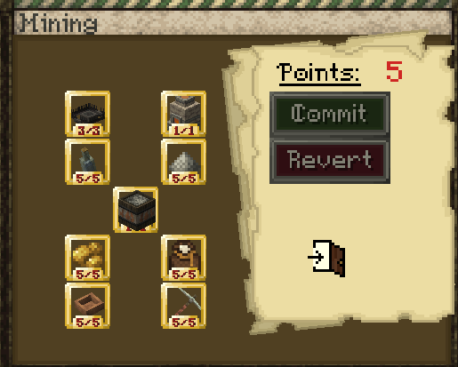
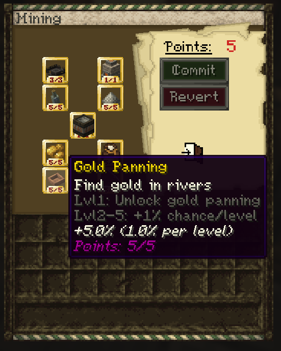
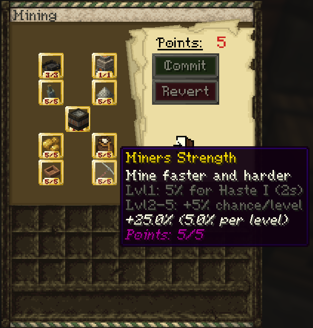
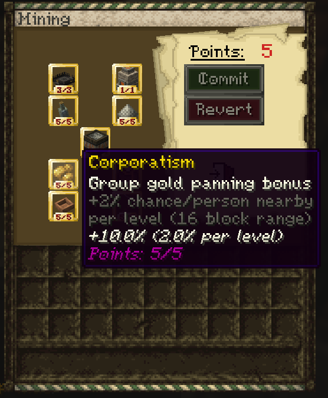
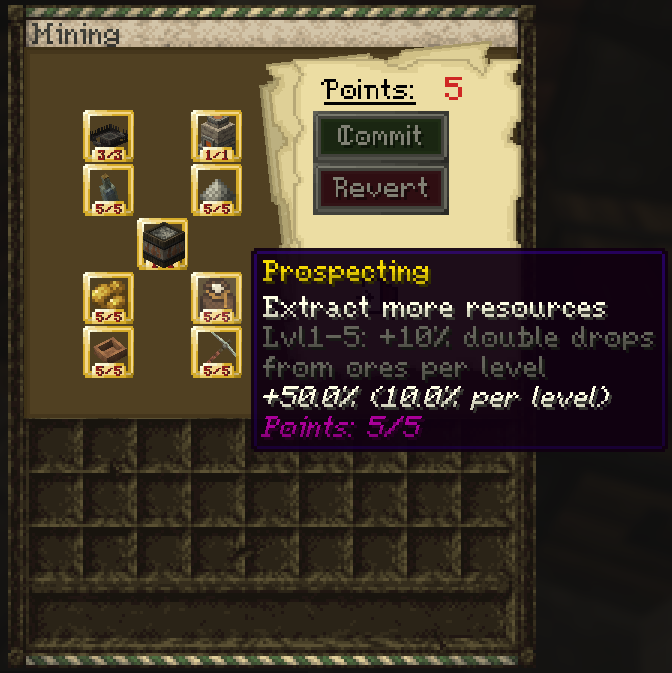
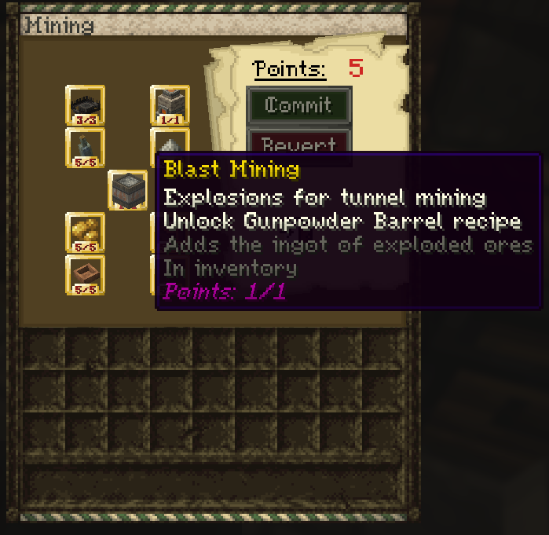
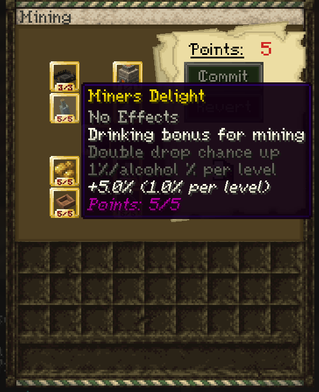
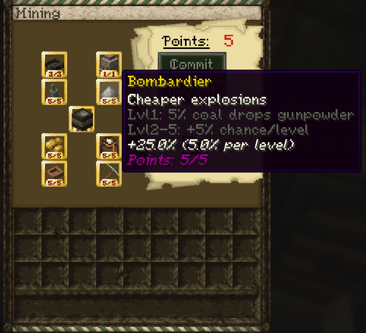
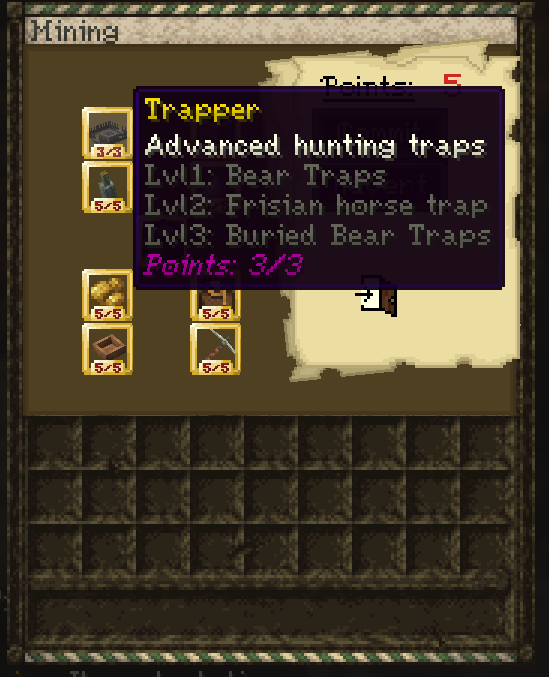
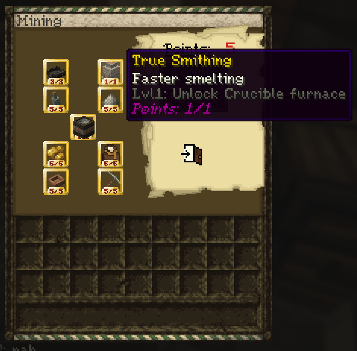

# Miner

**Important note: You need to have the miner profession to use the abilities in this guide. You can select a profession by using the `/mp` command.**

## Passive Effect

Miners gain **night vision** while breaking blocks below **Y 50**.

## XP Gain

The miner profession gains XP from mining ores.

## Skill Tree

The miner profession contains several skills that improve mining, resource gathering, explosives, trapping, and advanced smelting.

### Full Skill Tree

---

### Gold Panning

Find gold in rivers.

Lvl 1: Unlock gold panning  
Lvl 2–5: +1% chance per level  
Maximum bonus: +5%

---

### Miner's Strength

Mine faster and harder.

Lvl 1: 5% chance for Haste I for 2 seconds  
Lvl 2–5: +5% chance per level  
Maximum bonus: +25%

---

### Corporatism

Group gold panning bonus.

+2% chance per nearby person per level within 16 blocks  
Maximum bonus: +10%

---

### Prospecting

Extract more resources from ores.

Lvl 1–5: +10% double drops from ores per level  
Maximum bonus: +50%

---

### Blast Mining

Explosions for tunnel mining.

Lvl 1: Unlock Gunpowder Barrel recipe  
Adds the ingot of exploded ores directly to your inventory

---

### Miner's Delight

Drinking bonus for mining.

No effects by itself.  
Increases double drop chance by 1% per alcohol % per level  
Maximum bonus: +5%

---

### Bombardier

Cheaper explosions.

Lvl 1: 5% coal drops gunpowder  
Lvl 2–5: +5% chance per level  
Maximum bonus: +25%

---

### Trapper

Advanced hunting traps.

Lvl 1: Bear Traps  
Lvl 2: Frisian horse trap  
Lvl 3: Buried Bear Traps

---

### True Smithing

Faster smelting.

Lvl 1: Unlock Crucible Furnace

---

## Gold Panning

Gold panning is done by right clicking a river with a **wooden bowl**.

The default chance is **1%** without any skill upgrades and with no other miners nearby. The Gold Panning skill increases this chance, and Corporatism gives an additional bonus when other nearby miners are within range.

Video guide:

<!-- Add gold panning video here -->
<!-- Example:
<video controls src="VIDEO_LINK_HERE" title="Gold Panning"></video>
-->

## Blast Mining

Blast mining is used for tunnel mining with explosives.

To blast mine properly:

- Face a **cardinal direction**: `0`, `90`, `180`, `-90`, or `-180`
- Go below **Y 50**
- Place TNT
- Light it

If done correctly, more TNT will spawn in that direction and explode a tunnel. The ingots from exploded ores are added directly to your inventory.

Blast mining will not work in claimed chunks with explosions disabled.

You can enable explosions with:

- `/plot toggle explosion` on a plot basis
- `/t toggle explosion` on a town basis

Video guide:

<!-- Add blast mining video here -->
<!-- Example:
<video controls src="VIDEO_LINK_HERE" title="Blast Mining"></video>
-->

## Traps

### Bear Trap

Place the bear trap on the ground, then use a **shovel** to bury it and conceal it.

Players or mobs that step on it will take damage and be temporarily immobilized.

### Frisian Horse Trap

To make a Frisian horse trap:

- Place **two logs** next to each other
- Place **two wooden slabs** on top of them
- Right click one of the logs with an **axe**

Video guide:

<!-- Add traps video here -->
<!-- Example:
<video controls src="VIDEO_LINK_HERE" title="Miner Traps"></video>
-->

## Crucible Furnace

### Crucible Furnace-specific requirements

- 1 x Crucible + Tongs per slot (steel, cast iron, slag)
- 1 x Tongs (to pick up cast ingots)
- 1 x Ingot Cast
- 1 x Blast Furnace
- 1 x Clay Block

**Important: To use a Crucible Furnace, you need the True Smithing skill from the Miner skill tree.**

### Guide

The True Smithing skill gives access to the **Crucible Furnace**.

The main advantage of the Crucible Furnace is that it does not require temperature control like the bloomery does. This makes it a simpler way to produce **steel** and **cast iron** ingots. It can also process **slag**, so slag is no longer just a waste byproduct from the bloomery.

To create and use a Crucible Furnace:

- Place a **Blast Furnace** on the ground
- Place a **Clay Block** on top of it
- Right click it with a **hammer**
- Combine **Tongs** and **Crucibles** to make **Tongs with Crucibles**
- Put **raw iron** and **coal** into the Crucible Furnace
- Put the **Tongs with Crucibles** into any of the Crucible Furnace slots
- Wait until they fill up
- Take out a pair of tongs
- Place an **Ingot Cast** on the ground
- Right click the tongs onto the Ingot Cast
- Wait for the liquid to solidify
- Pick up the finished ingot with tongs
- Quench the tongs to cool the ingot
- When you want to use the ingot for crafting, reheat it in fire and pick it up again with tongs

Video guide:

<video controls src="https://github.com/Mvndi/docs/raw/refs/heads/main/src/assets/video/crucible.mp4" title="Crucible Furnace"></video>

## FAQ

#### Why is blast mining not working?

Make sure you are:

- Below **Y 50**
- Facing a valid cardinal direction
- Not in a claimed chunk with explosions disabled

#### How do I start gold panning?

Use a **wooden bowl** and right click a river.

#### What skill do I need for the Crucible Furnace?

You need **True Smithing**.
