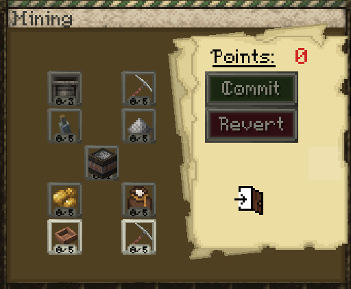
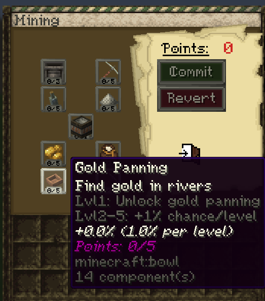
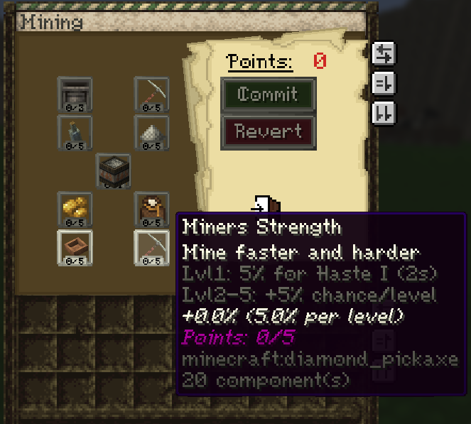
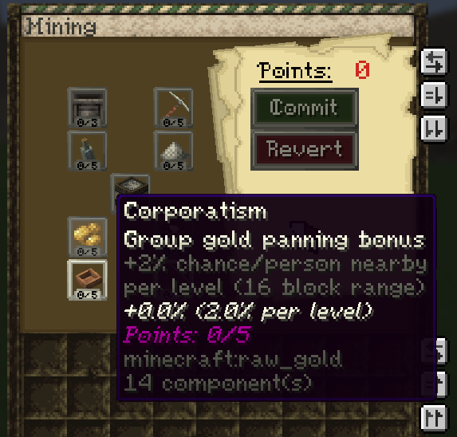
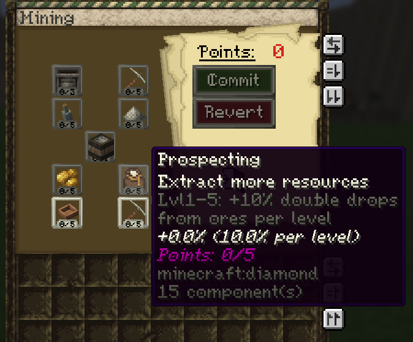
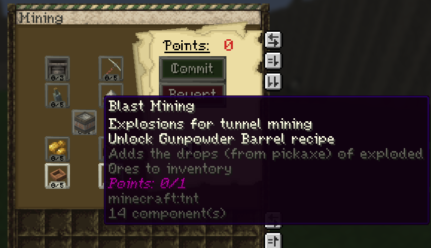
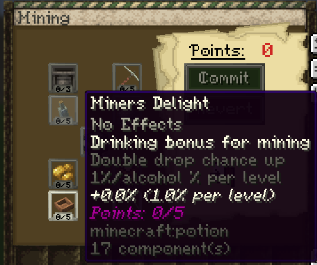
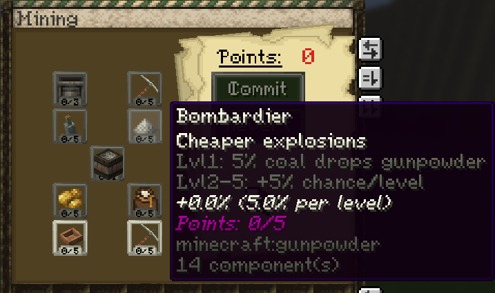
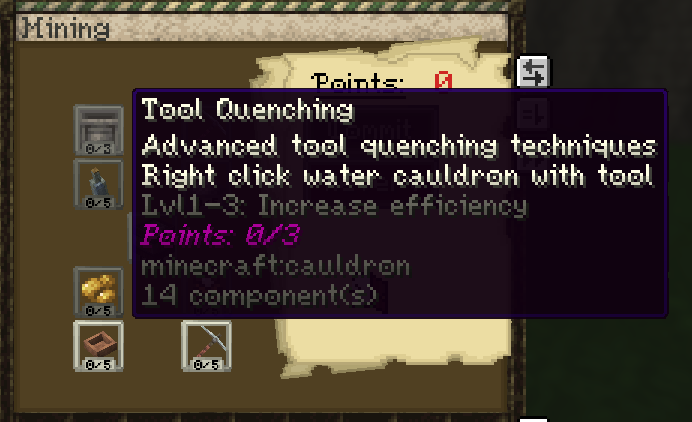
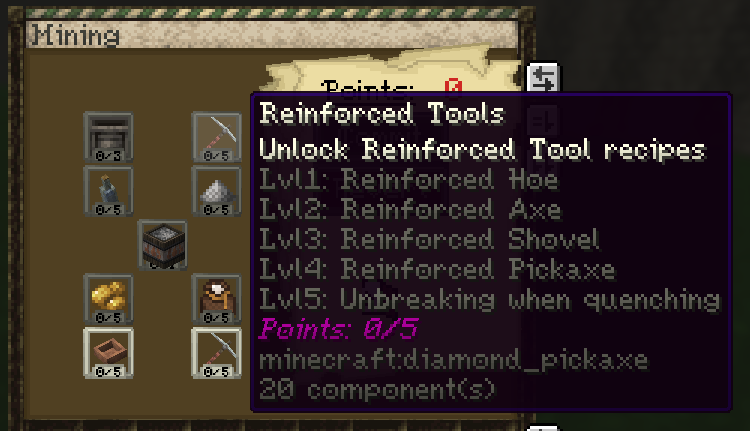

# Miner

**Important note: You need to have the miner profession to use the abilities in this guide. You can select a profession by using the `/mp` command.**

## Passive Effect

Miners gain **night vision** while breaking blocks below **Y 50**.

## XP Gain

The miner profession gains XP from mining ores.

## Skill Tree

The miner profession contains several skills that improve mining, resource gathering, explosives, trapping, and advanced smelting.

### Full Skill Tree

---

### Gold Panning

Find gold in rivers.

Lvl 1: Unlock gold panning  
Lvl 2–5: +1% chance per level  
Maximum bonus: +5%

Gold panning is done by right clicking a river with a **wooden bowl**.

The default chance is **1%** without any skill upgrades and with no other miners nearby. The Gold Panning skill increases this chance, and **Corporatism** gives an additional bonus when other nearby miners are within range.

Video guide:

<video controls src="https://github.com/Mvndi/docs/raw/refs/heads/main/src/assets/video/goldpanning.mp4" title="Gold Panning"></video>

---

### Miner's Strength

Mine faster and harder.

Lvl 1: 5% chance for Haste I for 2 seconds  
Lvl 2–5: +5% chance per level  
Maximum bonus: +25%

This skill gives a chance to gain **Haste I for 2 seconds** while mining, making it easier to break blocks faster.

---

### Corporatism

Group gold panning bonus.

+2% chance per nearby person per level within 16 blocks  
Maximum bonus: +10%

This skill increases gold panning chance when other nearby players are within **16 blocks**.

---

### Prospecting

Extract more resources from ores.

Lvl 1–5: +10% double drops from ores per level  
Maximum bonus: +50%

This skill increases the chance for ores to give double drops.

---

### Blast Mining

Explosions for tunnel mining.

Lvl 1: Unlock Gunpowder Barrel recipe  
Adds the ingot of exploded ores directly to your inventory

Blast mining is used for tunnel mining with explosives.

To blast mine properly:

* Face a **cardinal direction**: `0`, `90`, `180`, `-90`, or `-180`
* Go below **Y 50**
* Place TNT
* Light it

If done correctly, more TNT will spawn in that direction and explode a tunnel. The ingots from exploded ores are added directly to your inventory.

Blast mining will not work in claimed chunks with explosions disabled.

You can enable explosions with:

* `/plot toggle explosion` on a plot basis
* `/t toggle explosion` on a town basis

Video guide:

<video controls src="https://github.com/Mvndi/docs/raw/refs/heads/main/src/assets/video/tunnelmine.mp4" title="Blast Mining"></video>

---

### Miner's Delight

Drinking bonus for mining.

No effects by itself.  
Increases double drop chance by 1% per alcohol % per level  
Maximum bonus: +5%

This skill does nothing on its own unless alcohol is involved. It increases double drop chance based on alcohol percentage and skill level.

---

### Bombardier

Cheaper explosions.

Lvl 1: 5% coal drops gunpowder  
Lvl 2–5: +5% chance per level  
Maximum bonus: +25%

This skill gives coal a chance to drop gunpowder, making explosives easier to produce.

---

### Tool Quenching

Advanced tool quenching techniques.

Right click a **water cauldron** with a tool.

Lvl 1–3: Increases efficiency when quenching  

This skill works like the blacksmith quenching skills, but for tools instead of armor or weapons. It gives **Efficiency** enchants to tools through quenching.

---

### Reinforced Tools

Unlock reinforced steel tool recipes.

Lvl 1: Reinforced Hoe  
Lvl 2: Reinforced Axe  
Lvl 3: Reinforced Shovel  
Lvl 4: Reinforced Pickaxe  
Lvl 5: Unbreaking when quenching

This skill unlocks crafting of **reinforced steel tools**.
Grants **Unbreaking** when quenching

Normal steel tools correspond to **vanilla diamond tools**, while reinforced steel tools correspond to **vanilla netherite tools**.
