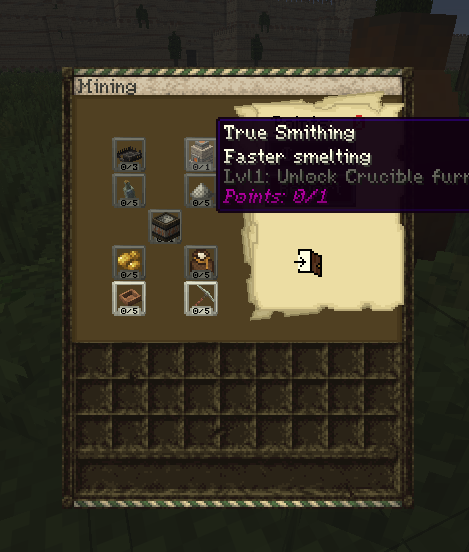

# Miner (GUIDE WIP)

Miners get night vision when breaking blocks under Y 60.

## XP Gain

Miner profession gains XP from mining ores.

## Skill Tree

Most of these are self explanatory so only explaining the not intuitive skills (wip guide will rewrite later)

To gold pan you right click a river with wooden bowl. Default chance is 1% without the skill upgraded and no other miners nearby

To blastmine properly face a cardinal direction (0, 90, 180. -90, -180) place a TNT under Y 60 and light it. More TNT will spawn in that direction and explode a tunnel, the ores will drop their items.

### Crucible Furnace

#### Crucible Furnace-specific requirements

- 1x Crucible + Tongs per slot (steel, cast iron, slag)
- 1x Tongs (to pick up cast ingots)
- 1x Ingot Cast
- 1x Blast Furnace
- 1x Clay Block

**IMPORTANT**: To use a crucible furnace, you need the **True Smithing** skill, which is in the **Miner** tree.

#### Crucible Furnace guide

The max level miner upgrade gives access to the Crucible Furnace. The main difference is that the Crucible Furnace doesn't require any kind of temperature control like the bloomery does, which makes it easier to make steel & cast iron ingots. You can also smelt slag in the crucible furance so it's not just a waste byproduct of bloomery anymore.

- Make the Crucible Furnace by putting a Blast Furnace on the ground, and putting a clay block onto it, and right click it with the hammer
- Combine Tongs & Crucibles to make Tongs with Crucibles
- Put raw iron & coal into the Crucible Furnace
- Put the Tongs with Crucibles into any of the Crucible Furnace slots
- Wait until they fill up
- Take a pair of Tongs out
- Place down an Ingot Cast onto the ground, then right click the Tongs onto the Ingot Cast
- Once the liquid has solidified, pick it up with a pair of Tongs
- Quench the Tongs to cool down the ingot
- Once you want to use the ingots for crafting, reheat them using fire and pick them up using tongs

<video controls src="https://github.com/Mvndi/docs/raw/refs/heads/main/src/assets/video/crucible.mp4" title="Crucible Furnace"></video>