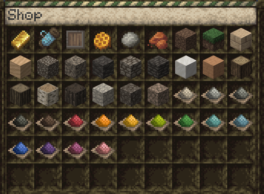

# Shop

The shop can be access with `/shop`. You can use the shop to buy or sell item to the server.

If the block you are trying to get is not in the `/shop`, check `/recipes` it might have a custom recipes. Some custom recipes are doable only from blocks bought from the `/shop`.

We do not want to put every blocks in the `/shop` so that players still trade bewteen players or explore the map to get rare resources.
That's why accacia wood is missing for example.

Some resources are also usually more worth it to farm than to buy. Dye can be farm by multiplying flowers with bone meal, including the 1 block tall flowers.
Others are much cheeper as sand so that players does not need to dig all beaches to get sand.

