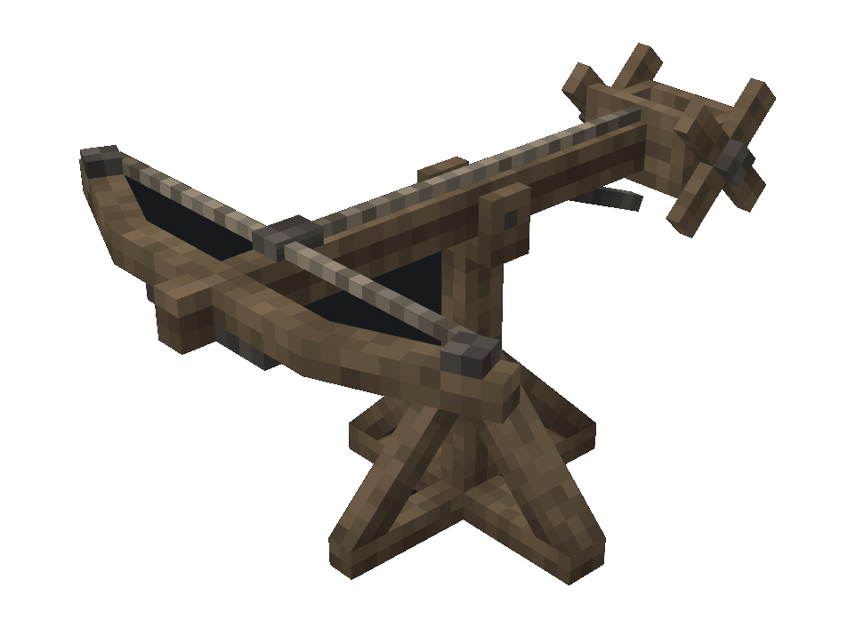
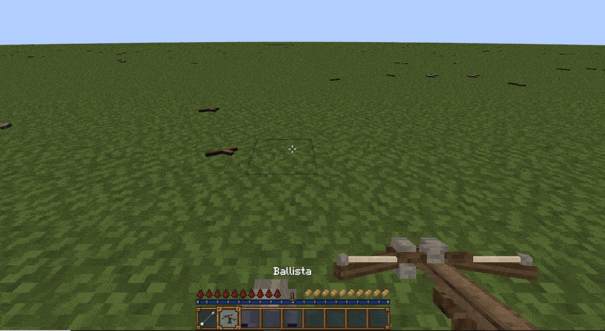

# Ballista

The ballista is a long-range anti-infantry turret. It 5% of the max HP of whatever part of the ship it hit. Breaks after 300 shots.

## Mounting

The ballista is mounted by right clicking it, and is aimed with the mouse. To dismount, walk away from the ballista.

## Loading

To load the ballista, first mount it. Then, right click the ballista with a standard bolt.

## Firing

Once the ballista is loaded, left click to shoot.

