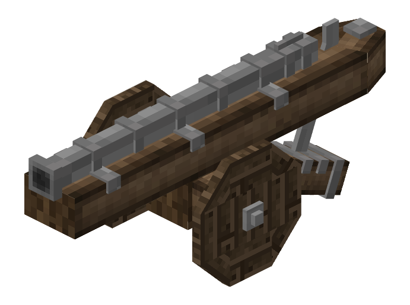

# Cannon

The cannon is a highly adjustable siege weapon with a large area of effect. It does 3  damage to ships.

## Adjusting

The range of the cannon is adjusted by left and right clicking the front of the piece to adjust the pitch. It is capable of shooting upwards as well as downwards.

The cannon can be rotated by sneaking and left or right clicking to adjust the yaw.

## Loading

To load the cannon, first right click the cannon with gunpowder pouches. The cannon requires 3 in order to load anything else.
After loading the gunpowder, move to the front of the cannon and right click with a cannonball or a canister shot to load the desired projectile.

- Cannonball: Can penetrate up to four blocks deep. Instantly kills and passes through any enemy it runs into.
- Canister Shot: An anti-infantry projectile which acts like a shotgun. Does not damage blocks.

## Firing

Once the cannon is loaded, right click the back of the cannon with a flint and steel to fire. There is a 16 second cooldown before firing again.

The cannon is for precise strikes. While it does break blocks it doesn't break a lot of them but has a deep penetration as opposed to the [Trebuchet](./trebuchet.md) which breaks more blocks but has less penetration.

