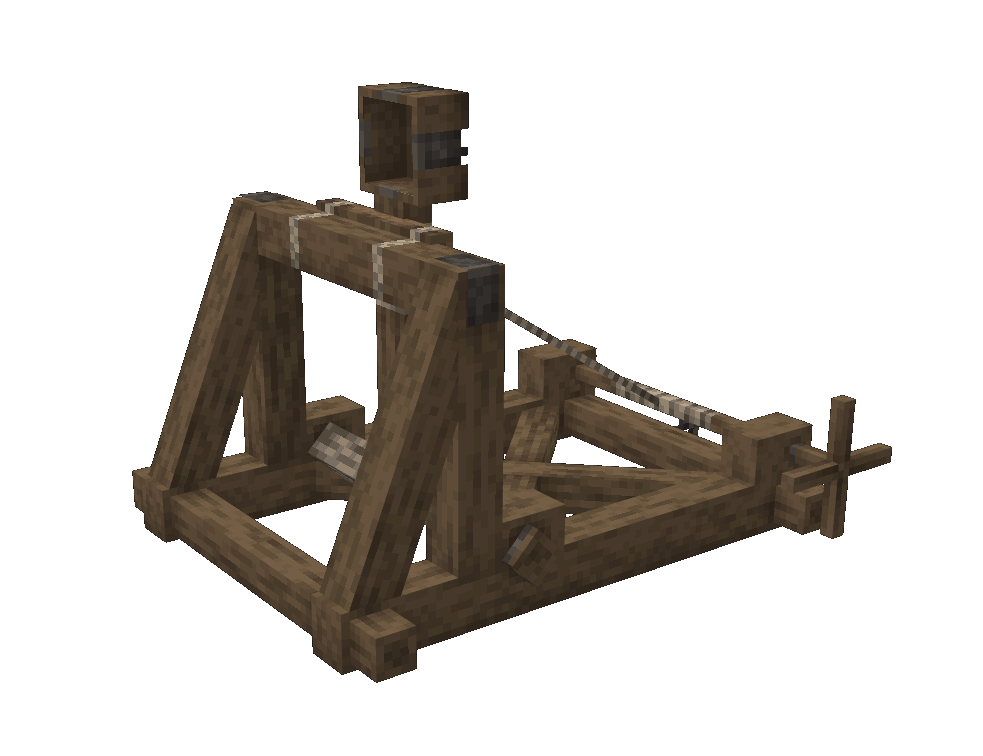

# Catapult

The catapult is a highly versatile siege weapon, it has three times of ammo. It does not damage the ship. Breaks after 300 shots.

## Adjusting

The range of the catapult is adjusted by right or left clicking the crank to add or reduce range.

The catapult can be rotated by sneaking and left or right clicking the back of the catapult.

## Loading

To load the catapult, put the ammo in the bowl by left clicking.

## Firing

Once the catapult is loaded, left click to shoot.

<video controls src="https://github.com/Mvndi/docs/raw/refs/heads/main/src/assets/video/catapult.mp4" title="Catapult"></video>