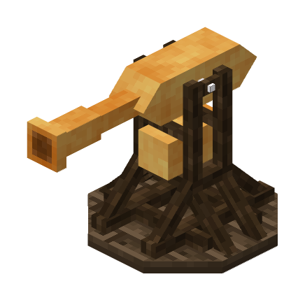

# Greek Fire

The greek fire is a short-range anti-infantry turret which acts like a flamethrower.

## Mounting

The greek fire is mounted by right clicking it, and is aimed with the mouse. To dismount, walk away from the weapon.

## Loading

To load the greek fire, first mount it. Then, right click the weapon with blocks of coal to load it. The greek fire can hold up to 5 blocks of coal, each of which provides about 3 seconds of firing time.

## Firing

Once the greek fire is loaded, left click with a flint and steel to activate it.

