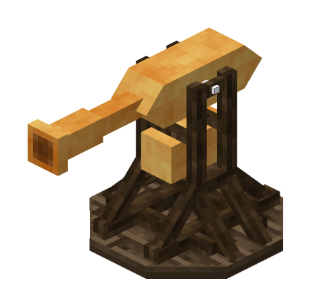

# Greek Fire

The greek fire is a short-range anti-infantry turret which acts like a flamethrower. If fired at water it will create fire on the water’s surface that last for 60 seconds. Burns foliage like berry bushes. For ships it does 0.1 damage but there's some RNG because it shoots a lot of projectiles (without the RNG it was a death lazer that sawed ships in half). Also ship takes passive damage and passengers nearby where the greekfire. Breaks after 500 coal blocks of shooting (fireing 1 coal block worth of fuel consumes 1 durability of 500). Will  overheat if fired too much without letting it cooldown, if it overheats it can't be shot for 2 minutes.

## Mounting

The greek fire is mounted by right clicking it, and is aimed with the mouse. To dismount, walk away from the weapon.

## Loading

To load the greek fire, first mount it. Then, right click the weapon with blocks of coal to load it. The greek fire can hold up to 5 blocks of coal, each of which provides about 3 seconds of firing time.

## Firing

Once the greek fire is loaded, left click with a flint and steel to activate it.

