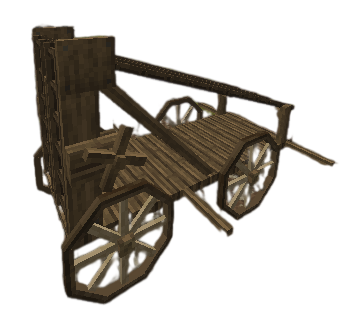

# The siege ladder

This siege weapon solves the issue of scaling walls and making the gameplay closer to how medieval sieges were fought.

The ladder is quite heave to carry and is therefore easier to push with your allies, it can be pushed and pulled back in increments of one half blocks by a total of 4 people for full speed. If you start pushing you will be visible through walls to your enemies.

The height can be toggled with the right crank up to a maximum of 30 blocks while the left crank is used to activate the ladder and lock it into place, the timer for the ladder being raised is 3 minutes and for every block added it’ll be an extra 5% to the timer.

Once the ladder finishes locking into place the platform will be usable.

To destroy the ladder you can either damage it by hitting the bottom part with an Axe, firing at it with a cannon or trebuchet or hitting it with greek fire grenades. The ladders can only be placed by attackers during a siege or a raid, the amount you can place is based on your town level.
