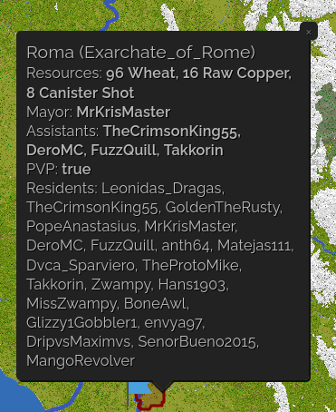

# Towny Resources

## What is Towny Resources?

Towny Resources is a towny extension that allows towns to generate
resource income.

## How do I use Towny Resources?

You start by surveying with the command `/t resource survey`. This will add a resource to your towns
production and will allow you to collect the income 1. per towny day.
Each consequent survey will be more expensive.
The following table provides an overview of the levels:

You can see the resources production of a town with `/t <town name>` or look on the map

| Survey Count: | Survey Cost | Required Town Size | Resource Production Mutiplier | Required Players to gain income |
| ------------- | ----------- | ------------------ | ----------------------------- | ------------------------------- |
| 1             | 250         | 10                 | 1                             | 1                               |
| 2             | 1000        | 50                 | 2                             | 6                               |
| 3             | 5000        | 100                | 3                             | 14                              |
| 4             | 20000       | 200                | 4                             | 24                              |

You can also reroll ALL of your resources with `/t resources reroll` for `50k` ducats.
Available resources are:

- coal
- stone bricks
- terracotta
- sandstone (you can only roll this with surveys in beach and desert biomes)
- diorite
- andesite
- glass
- raw iron
- quartz blocks
- raw gold
- magnetite
- wheat
- cooked beef
- raw copper
- cannister shots
- cannonballs
- boulders
- steel bolts
- gunpowder pouches

Some resources are rarer than others.
More info can be found [here](https://github.com/TownyAdvanced/TownyResources/blob/master/README.md).

## Who is getting the resources

A free town with no nation get 100% of the resources.

A free town in a nation gets 50% of the resources and the nation gets the other 50% of the resources.

An occupied town gets 25% of the resources & the occupying nation gets the other 75% of the resources.
