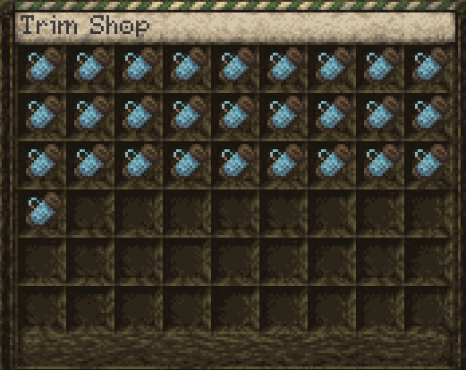
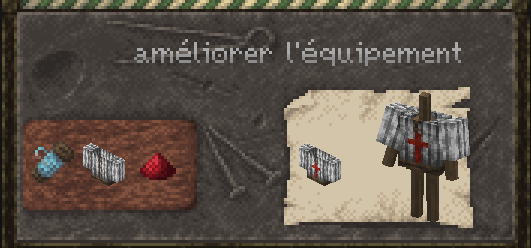
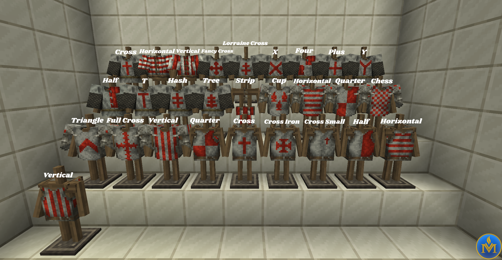

# Trim Shop

The trim shop can be access with `/trimshop`. You can use the shop to buy forge trims to the server.

Each trim can be used in the smithing table by shift right clicking it and using an or on the associate armor.

